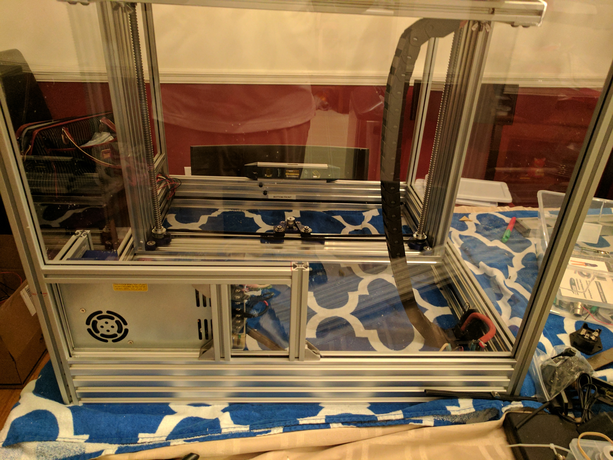

Meanwell 350W Power Supply Mount for Herculien
==============================================

The Meanwell 350W power supply has different dimensions than the 450W version.  The printed brackets on the bottom in the Herculien BOM work fine, but the 350W version is much narrower than the 450W, and therefore the upper bracket does not fit.  In addition, on the 450W version, the terminals face out from the side of the power supply, while the 350 watt version faces toward the back of it (I am considering the side with the fan and vents on it as the back due to the orientation of the power supply in the Herculien.)  This means that, if you are putting in acrylic/Lexan walls, the terminals would be inaccessable once the panel goes in.

This mod builds a small frame around the power supply and creates a small sliding window that can be opened to allow access to the terminals, but also protects them from anything accidentally falling into the back of the printer.  The 350W power supply will be installed in the same orientation as the 450W, with the fan facing the back of the printer frame.  The terminals should be on the left side, away from the right side wall if you are facing the frame from the front.  All right/left/top/bottom directions are based on the viewer standing at the front of the printer, looking toward the back, unless otherwise noted.

The instructions below assume that you have not yet completed the top section of the printer frame.  If you are reading this prior to completing the bottom section of your frame, you can add two T-slot nuts to the top of the Back Rear 20 x 80 extrusion before assembling the bottom frame, and you won't need the drop in ones.  If you've already put together the top section of the frame, you can use a 90 degree angle bracket to secure the 272mm extrusion to the right rear upright instead of drilling a hole and using a screw in the end.

Tools Required
==============

Hex allen key for M5 Screws
Hex allen key for M4 Screws

Parts Required
==============

1 20 x 20 x 272mm extrusion (This can be longer if you want a bigger window.  You will need to adjust your acrylic/Lexan size accordingly)
1 20 x 20 x 136mm extrusion
1 20 x 20 x 116mm extrusion
3 90 degree angle brackets for 20 x 20 extrusions
4 M4 x 12mm screws
2 M5 x 10mm button head screws
6 M5 x 8MM button head screws
4 M5 T-Slot nuts
2 M5 Drop-in T-Slot nuts (I've found the Misumi ones are the nicest)
1 peice of acrylic/Lexan 87mm x 128mm (you should be able to cut this out of scrap left over from cutting the other panels)
a little less than 500mm HSCA5 slot covers
2 x Power Supply Bracket 2 from the original BOM (Printed)
2 x Power Supply Bracket from this mod (Printed)

Metal Preparation
=================

Using the 20x80 8 hole drill guide drill a hole in the right rear upright.  The hole should be centered at 205mm from the bottom end of the extrusion.  

Using an M5 tap, tap both ends of the 272mm extrusion, and one end of the 136mm extrusion.

Secure the 20 x 20 drill guide to one end of the 136mm extrusion using 3 M5 x 8mm screws and 2 M5 T-Slot nuts.  Drill a 5mm hole using the first hole from the end through the extrusion.  

If you want, cut out the center section of the top of the 136mm extrusion (from the end to the hole, see photo) to create a channel for the acrylic/Lexan to fit in.  I used a bandsaw for this, but a hacksaw or dremel probably would work too.  This will make the cuts in the acrylic/Lexan easier.

Assembly
========

Attach both of the Power Supply Bracket 2 to the bottom of the power supply with 2 M4 x 12 screws. Using the two M5 x 8mm and M5 T-slot nuts previously installed on the 20 x 80 extrusions at the bottom rear of the frame, secure the power supply to the frame with the right side of the power supply.

Insert an M5 x 10mm screw into both ends of the 272mm extrusion, leaving 2-3mm of threads exposed.
Insert 2 M5 T-Slot nuts into the front side of the 272mm extrusion

In the 116mm extrusion attach two 90 degree angle brackets using two M5 T-Slot nuts and two button head M5 x 8mm screws on the same face of the extrusion.  

Attach an M5 x 8mm screw and T-slot nut to one of the angle brackets on the 116mm extrusion. 

Slide the T-slot nut into the bottom of the 272mm extrusion so that the two angle brackets are on the side of the 116mm extrusion facing towards the left as you are looking at it.  Tighten down the angle bracket somewhere in the middle of the 272mm extrusion to keep it from sliding around.

On a flat surface, slide the 136mm extension over the screw in the end of the 272mm extrusion.  The 90 degree angle brackets on the 16mm extension should be facing away from the 136mm extrusion.

Using the hole drilled in the end of the 136mm extrusion and the allen key tighten the screw down ensuring the ends of the extrusion are flush on all sides.

Insert an M5 x 8mm button head screw into the remaining 90 degree angle bracket and secure it to the left side of the 136mm extrusion on the left.  Both this bracket, and the right facing one on the bottom of the other 116mm extrusion should be secured so that they are a few mm above the end of the extrusion.

Loosely attach the two drop-in M5 T-Slot nuts to the bottom of the 90 degree angle brackets on the bottom of the 46mm extrusions.

Secure the 2 Power Supply Brackets from this mod to the 2 T-slot nuts on the front side of the 272mm extrusion

You should now have something that looks like an F with the remaining power supply brackets attached to the front of it.

Back View: 

Front View: 

Insert the slot covers into the left side of the center 116mm extrusion and the right side of the left mm extrusion, and place 128mm peices of slot cover in the bottom of the 272mm extrusion and the top of the 20 x 80 extrusion, approximately in front of the terminals of the power supply.

Insert the acrylic/Lexan into the F shaped assembly and move the center extrusion into place to hold it.

Slide the screw at the end of the 272mm extrusion down the left side of the right rear upright until it is in postion The 46mm extrusions should be touching the 20 x 80 rear bottom extrusion and the acrylic/Lexan should be seated into all four sides.  If you have already built the top section, then you can use a 90 degree angle bracket and a drop in nut to secure the "F" assembly to the right rear upright on the frame.

Slide the two 90 degree angle brackets down to the 20 x 80 extrusion and tighten the screws into place.

Loosen the top two power supply brackets and slide them into place.  Secure the power supply brackets to the power supply using 2 M4 x 12mm screws, and tighten the M5 x 8mm screws attaching it to the 272mm extrusion.

Finished Installation:

Usage
======

When you need access to the power supply terminals, loosen the two screws attaching the center 116mm extrusion to the top and bottom extrusions.  You should be able to slide it out of the way, and slide the acrylic/Lexan with it, exposing the terminals. 

Closed: 

Open: 

