Herculien Build Guide
=====================

This guide is intended to get you through the basics of assembling the Herculien
3D Printer.  It is a living document so be aware that the procedure is subject to change.

Pictures are included for clarity and where necessary YouTube videos will be embedded.

The guide will be structured around the subassemblies that are listed in the BOM however
to save time later we will include parts/fasteners from other subassemblies where
needed.

Tools Required
==============

 * 2.5mm Hex Wrench
 * 3mm Hex Wrench
 * Bubble Level (for leveling the Z Gantry)
 * Multimeter
 * Saw for cutting aluminum
 * Marker
 * Masking tape
 * Metric tap set (only a 5mm tap is required)
 * Drill
 * 1mm drill bit or equivalent imperial standard bit (This is just used for drilling pilot holes so it doesn't have to be precise but needs to be small enough to fit in the drill guide)
 * 5mm drill bit
 * 8mm drill bit
 * 7/8" drill bit
 * 1/2" End mill
 
Metal Preparation
=================

 1. Using the 5mm x .8 thread tap, tap all of the regular 20x80 extrusion end holes
    * Use cutting oil
    * Go Slow
    * You can either do by hand or using a drill.  If you use a drill you must take it VERY slow as you can easily break the tap bit.
 
    Example:
    

Main Frame
==========

## Parts required:

 * 9x 20x80 Aluminum Extrusions cut to 569.5mm
 * 4x 20x20 Aluminum Extrusions cut to 609.5mm
 * 2x 20x80 V-Slot Aluminum Extrusions
 * 102x T-Slot Nuts
 * 160x M5 x 10mm Button Head Screws
 * 6x M5 x 8mm Flat Head Socket Cap Screws
 * 16x M5 x 8mm Button Head Screws

## Bottom Assembly

 1. The BOM lists a 1 meter section of V-Slot, if you haven't cut the V-Slot you should do that now.
    * To cut the V-Slot you can use any saw or cutting wheel capable of cutting through a 20x80 extrusion.
    * I was successful doing this with an angle grinder and metal cutoff blade.
    * While you should be careful to cut this as straight as possible it isn't necessary to
      cut this exactly straight.  The factory cut ends are straight and those will be what is used
      to square the verticals for the Z Gantry rails to be perpendicular to the center rail.
    
 2. Using your marker and masking tape, label each of the 9 20x80 extrusions using the following labels.  These labels aren't necessary
    but will make things easier in the following steps to keep things in order.  It also helps to indicate which end it up, I use arrows
    on the masking labels.
    
    * Top Front
    * Top Rear
    * Top Right
    * Top Left
    * Bottom Front
    * Bottom Rear
    * Bottom Right
    * Bottom Left
    * Center Rail
    
    Example:
    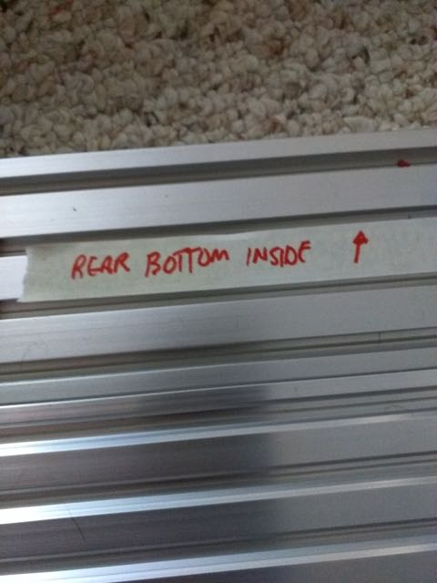

 3. Using your marker and masking tape, label each of the 4 20x20 extrusions with the following labels.
    * Front Right
    * Rear Right
    * Front Left
    * Rear Left
    
    Example:
    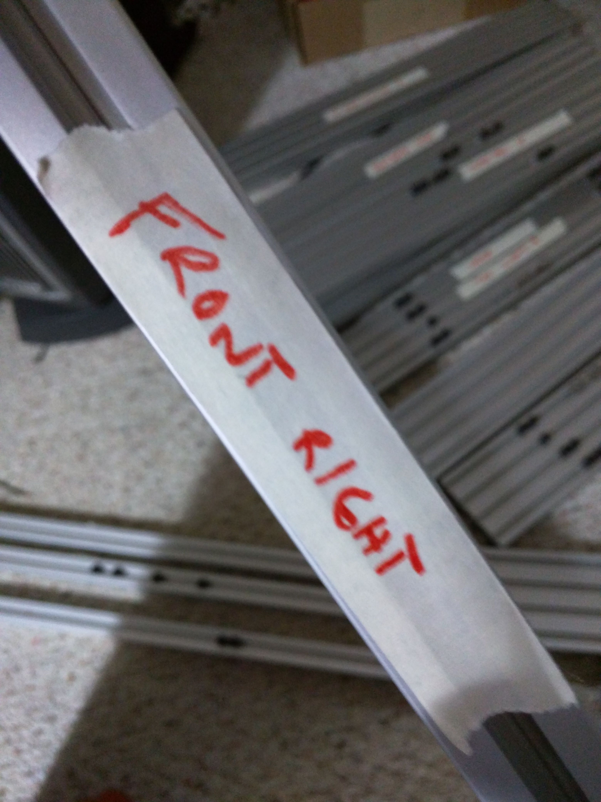
  
 4. Locate the 4 20x20 extrusions to be used at vertical supports for the main frame.
  
 5. Using 3 M5x8mm button head screws and 2 T-Slot nuts attach the 20x20 extrusion drill guide to one end of the extrusion.
  
     Examples: 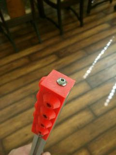
               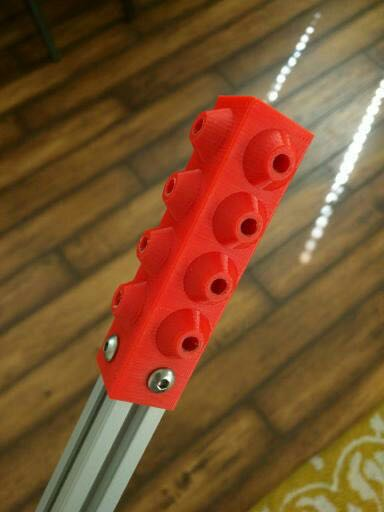
  
 6. Using the 5mm drill bit, drill all 8 holes using the raised drill guide holes.
     
     Result: 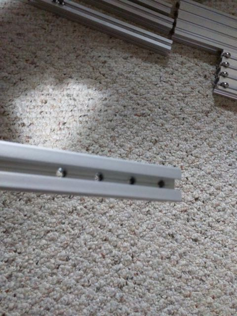
  
 7. Repeat this process for the other end of the extrusion and then for the remaining 3 verticals.
  
 8.  Locate the two 20x80 extrusions marked "Bottom Right" and "Bottom Left"
  
 9.  Beginning with one of these, use 4 M5x8mm button head screws and 4 T-Slot nuts attach the 20x80 8 hole drill guide but do not tighten down.
  
 10. Measure from one end of the extrusion 215mm and slide the drill guide over until the very edge of it lines up with that line.
      
      Drawing: 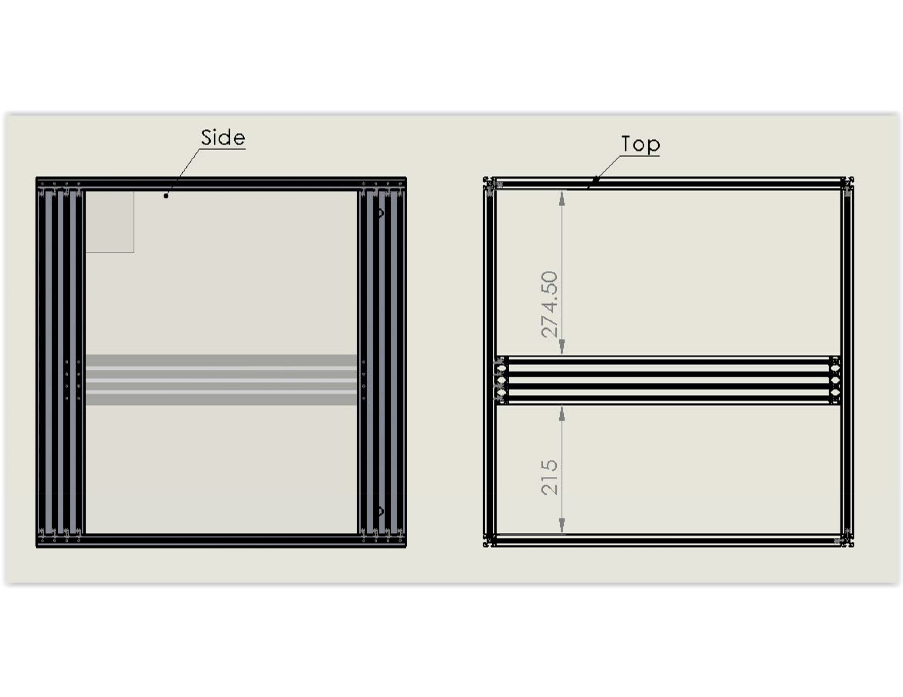
      
 11. Tighten the drill guide down and double check your measurement until it is **EXACT**
  
 12. Drill all 8 holes using the 5mm drill bit.
  
 13. Repeat for the other piece making sure your measurements are **EXACT**
  
 14. Orient the two pieces standing on their 20mm side on the floor or other flat surface keeping the perspective that you are looking at the completed chassis from the front.  e.g. "Bottom Left" goes to your left and "Bottom right" goes to your right.
  
 15. Ensure the 2 rows of holes you just drilled are nearest the top of the extrusion and the side measured 215mm from edge to the drill guide is placed facing you.
  
 16. Now using the masking tape and markers label the inside face of each so that the orientation is clear.
      
      Result: 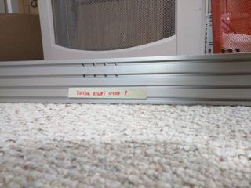
              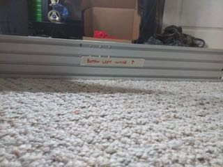
              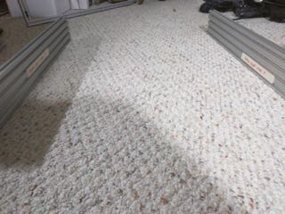
   
 17. Locate the 20x80 extrusion pieces marked "Bottom Front" and "Bottom Rear"
 
 18. Orient the pieces on the floor or flat surface with the 2 bottom left and right extrusions with one 20mm side lying flat on the surface.
 
     Example: 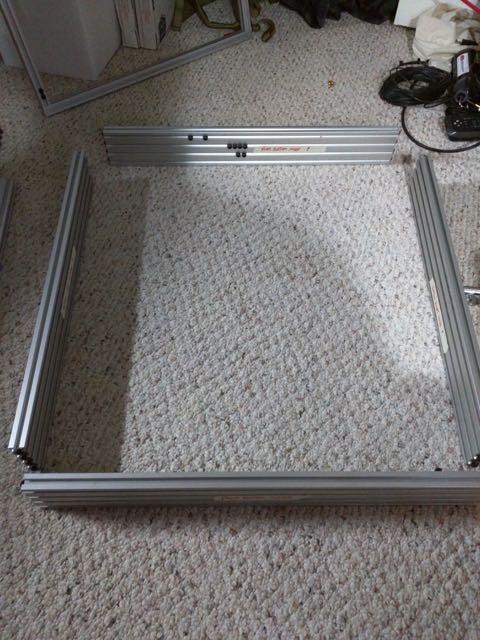
 
 19. Using the marker and masking tape, label the inside of each and use an drawn arrow to indicate which way is up.
 
 20. On the piece marked "Bottom Rear" insert 2 T-Slot nuts in the top row of the innermost side.  Insert 4 T-Slot nuts in the row below that.  Insert 2 T-Slot nuts in the row below that.  Use M5x10mm button head screws hand tightened to hold them in place.
 
     Example: 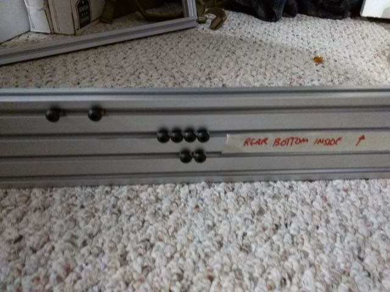

 21. On the piece marked "Bottom Front" insert 1 T-Slot nut on the top row of the innermost side.  Insert 1 T-Slot nut in the row below that.  Use M5x10mm button head screws, hand tightened, to hole them in place.
 
     Example: 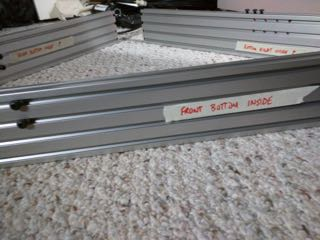
 
 22. On the piece marked "Bottom Right" insert 3 T-Slot nuts on the top row and use M5x10mm button top screws, hand tightened, to hold them in place.
     
     Example: 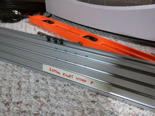
 
 23. Thread M5x10mm button head screws into each of the 4 holes on each end of the 4 bottom 20x80mm extrusions placed on the flat surface from earlier.  Thread the screws in until there is only approximately 3-4mm of thread showing.
 
     Example: 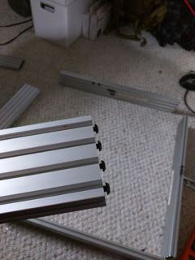
 
 24. Locate the 20x80 extrusion labeled "Center Rail"
 
 25. Thread M5x10mm button head screws in the 4 holes in each of the ends of the "Center Rail" leaving only about 3-4mm of thread showing.
 
 26. Slide one side of the center rails button head screws in the bottom left 20x80 extrusion's second from the top slot and visually line it up with the 4 holes that are drilled in the bottom left piece.
     
     Example: 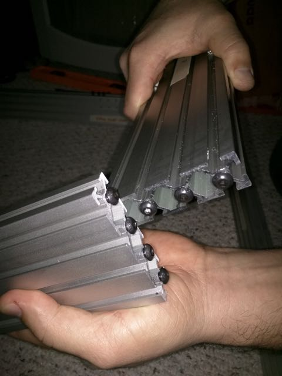
     
 27. Using your measuring tool measure 215mm from the front edge of the "Bottom Left" 20x80mm extrusion to the edge of the "Center Rail".
     
     Example: 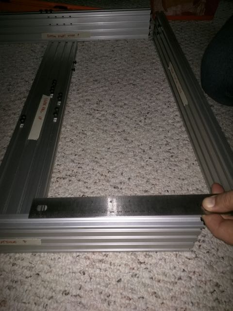
 
 28. Passing the 2.5mm hex wrench through the holes in the opposite side of the "Front Left" extrusion tighten the button head screws on the "Center Rail" locking them in place.  Be sure to double check your measurements.
 
     Example: 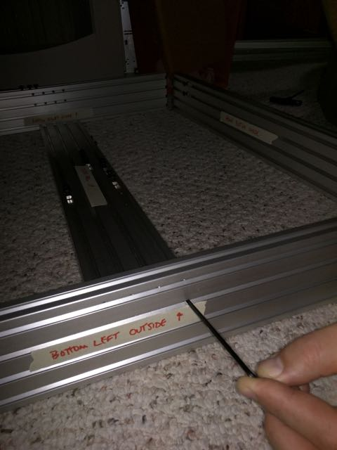
 
 29. The Front of the Center rail is now the side measured 215mm away from the front edge of the supporting extrusion.  If it helps you to keep track of these things use the masking tape and marker to label the side that is front.
 
 30. On the front side of the center rail insert 2 T-Slot nuts and use 2 M5x10mm button head screws, hand tightened, to hold them in place. On the top of the "Center Rail" in the first of four slots insert 4 T-Slot nuts with M5x10mm button head screws to hold them in place.  Do the same for the second from the front edge slot.  Skip the third slot and on the foourth slot from the front insert 2 T-Slot Nuts with 2 M5x10mm button head screws to hole them in place.
     
     Example: 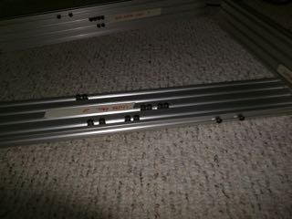
     
 31. Now repeat step 26-28 for the other side of the Center Rail, securing the Center Rail to the "Bottom Right" 20x80mm extrusion.
 
     Example: 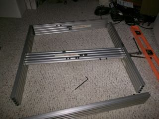
 
 32. Locate the 2 V-Slot 20x80 extrusions measuring 489.5mm.  These do not need labels as they are identical and either will work on either side.
 
 33. With one of the V-Slot extrusions on one 80mm side nearest the factory straight cut insert 1 T-Slot nut in each slot and hand thread 1 M5x8mm button head screw for each T-Slot nut but do not tighten.
 
     Example: 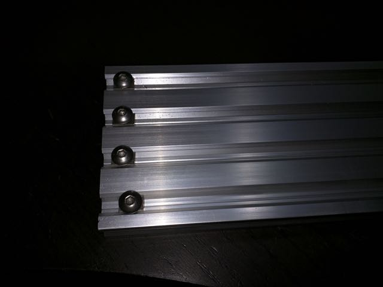
 
 34. Slide the button head screws in the top slot of the "Bottom Left" 20x80mm extrusion.  I find it's easier to stand the "Bottom Left", "Center Rail" and "Bottom Right" assembled pieces on one end so that it looks like an "H".
 
     Example: 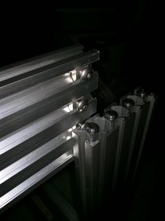
 
 35. Carefully slide this assembly down the rail and place it sitting on top of the Center Rail extrusion and make sure the edges of the V-Slot are flush with the Center Rail extrusion on both sides.
 
 36. Passing the 2.5mm hex wrench through the holes on the opposite side of the "Bottom Left" extrusion tighten down each screw.
 
 37. Double check your measurements and ensure that the front 20mm edge of the V-Slot extrusion is exactly 215mm away from the front edge of the "Bottom Left" extrusion.
 
     Example: 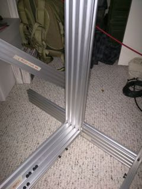
 
 38. Repeat steps 33-37 for the "Bottom Right" 20x80mm extrusion using the remaining V-Slot extrusion.
 
 39. Locate the 4 20x20 extrusions that are 609.5mm long.  These are the verticals to hold everything upright.
 
 40. Find the 20x80 extrusions marked "Bottom Front" and "Bottom Left" and use the 20x20 vertical marked "Front Left" for the next step.
     
 41. Slide button head screws at the end of the "Bottom Front" 20x80 extrusion's left side into the slot of the 20x20mm extrusion and then do the same with the 20x80mm "Bottom Left" extrusion at a right angle to the "Bottom Front" extrusion.  See picture for example.
     
     Example: 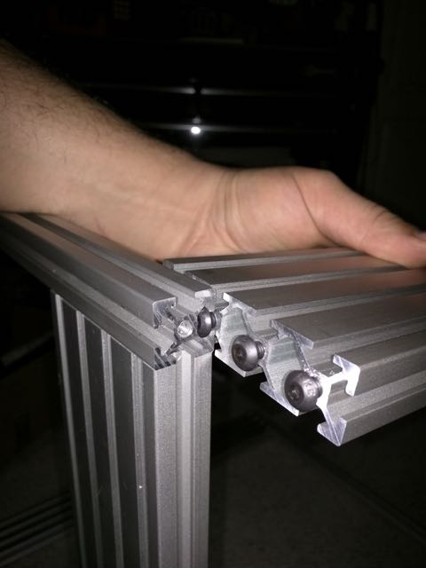
 
 42. Use your 2.5mm hex wrench to tighten the button head screws by passing the wrench through the holes drilled in the 20x20 extrusion.  **ENSURE** the bottom of the 20x80 extrusions are flush with the bottom of the vertical 20x20 extrusion.
     
     Example: 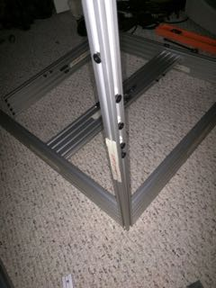
     
 43. Repeat steps 25-27 for the 4 corners paying close attention to use the correct vertical per corner.  If you use the wrong one, you can switch their labels once you're finished.  The labeling matters in the coming steps.
     
     Example: 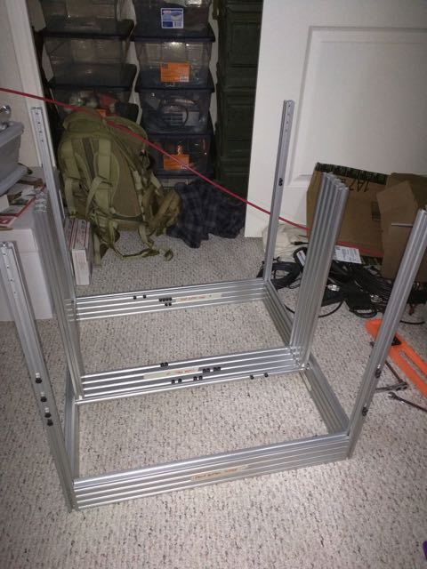
 
## Top Assembly

 1. Locate the 20x80mm extrusion marked "Top Front" and lay it flat on one of it's 80mm sides in front of you.
 
 2. We will assume this is now the inside of the top front extrusion and the 20mm side furthest from you is the side that will be at the top of the finished chassis., mark it with the tape and marker.
    
    Example: 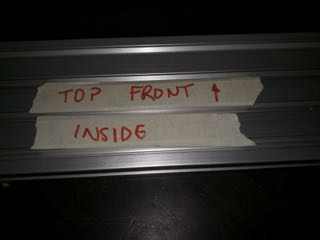
    
 3. Locate Corner Bearing Bracket B, this is a printed part.
 
 4. Place Corner Bearing Bracket B on the right side of the 80mm side facing you with the bearing support hole closest to the edge of the printed part laying flat on the extrusion.  Make sure the printed part is lined up against the right edge with the opposing bearing support hole vertical and flush with the edge.
 
    Example: 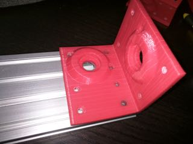
 
 5. Locate the printed extrusion drill guide shown below.
 
    Example: 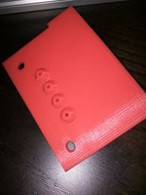
 
 6. Place this drill guide under the Corner Bearing bracket and make note of the hole you should be drilling, it will be in the center of the hole in the corner bearing bracket.  It should be the top most pilot hole on the drill guide.
 
    Example: 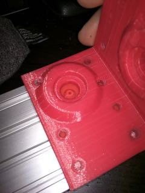
             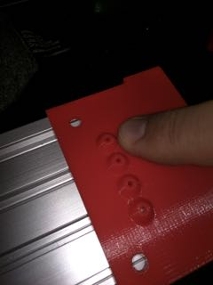
 
 7. Set the Corner Bearing Bracket B aside for later use.
 
 8. Using 4 M5x10mm button head screws secure the drill guide to the right edge of the extrusion.
 
    Example: 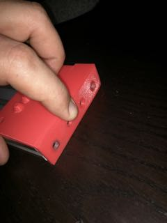
 
 9. Using 2 T-Slot nuts and 2 M5x10mm button head Screws secure the 2 holes on the upper face of the drill guide to the extrusion.
 
    Example: 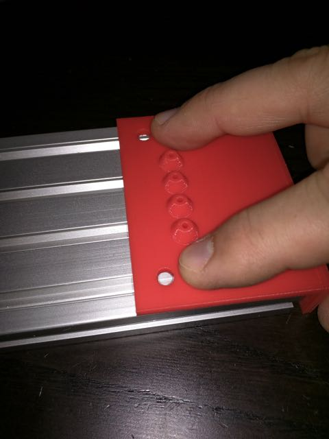
 
 10. If you have access to a drill press you would be best served using it for the next drilling steps but a hand drill used carefully will suffice.
 
 11. Drill the top most pilot hole using a small bit.
 
 12. Remove the drill guide and set the screws and T-Slot nuts aside.
 
 13. Using a slightly larger bit (I used a 5mm bit) drill out the pilot hole.
 
 14. Using your 1/2" end mill drill the final hole through the extrusion.
 
     Example: 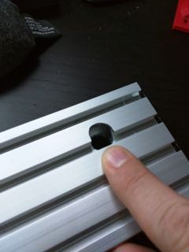
 
 15. At this time you can choose to use a round file to clean up the drilled hole.
 
 16. Lay the extrusion down on a table or the floor in front of you with the labeled inside facing you and the top 20mm side facing away from you.
 
     Example: 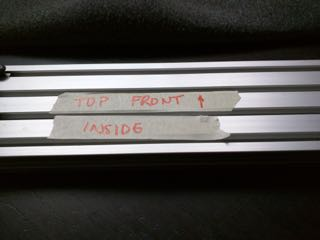
 
 17. In the slot closest you insert 8 T-Slot nuts and hand tighten 1 M5x10mm button head screw into each so that the T-Slot nuts do not slide around.
 
 18. In the slot above that insert 4 T-Slot nuts and hand tighten 1 M5x10mm button head screw into each so that the T-Slot nuts do not slide around.
 
 19. In the slot above that insert 2 T-Slot nuts and hand tighten 1 M5x10mm button head screw into each so that the T-Slot nuts do not slide around.
 
 20. In the top slot insert 4 T-Slot nuts and hand tighten 1 M5x10mm button head screw into each so that the T-Slot nuts do not slide around.

     Example: 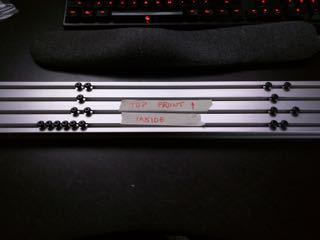
 
 21. Thread M5x10mm button head screws into the 4 holes on each end of the extrusion.
 
     Example: 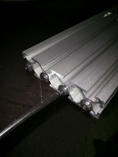
 
 22. Set this extrusion aside for later use.
 
 23. Locate the 20x80mm extrusion labeled "Top Rear" and lay it flat on one of it's 80mm sides in front of you.
 
 24. We will assume this is now the inside of the top rear extrusion and the 20mm side furthest from you is the side that will be at the top of the finished chassis., mark it with the tape and marker.
 
     Example: 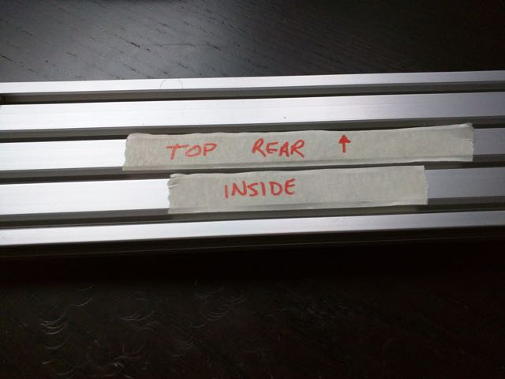
 
 25. Locate Corner Bearing Bracket B, this is a printed part.
 
 26. Place Corner Bearing Bracket B on the right side of the 80mm side facing you with the bearing support hole closest to the edge of the printed part laying flat on the extrusion.  Make sure the printed part is lined up against the right edge with the opposing bearing support hole vertical and flush with the edge.
 
     Example: 
     
 27. Locate the printed extrusion drill guide shown below.
 
     Example: 
 
 28. Place this drill guide under the Corner Bearing bracket and make note of the hole you should be drilling, it will be in the center of the hole in the corner bearing bracket.  It should be the top most pilot hole on the drill guide.
     
     Example: 
             
     
 29. Set the Corner Bearing Bracket B aside for later use.
 
 30. Using 4 M5x10mm button head screws secure the drill guide to the right edge of the extrusion.
 
    Example: 
 
 31. Using 2 T-Slot nuts and 2 M5x10mm button head Screws secure the 2 holes on the upper face of the drill guide to the extrusion.
 
    Example: 
 
 32. If you have access to a drill press you would be best served using it for the next drilling steps but a hand drill used carefully will suffice.
 
 33. Drill the top most pilot hole using a small bit.
 
 34. Remove the drill guide and set the screws and T-Slot nuts aside.
 
 35. Using a slightly larger bit (I used a 5mm bit) drill out the pilot hole.
 
 36. Using your 1/2" end mill drill the final hole through the extrusion.
 
     Example: 
 
 37. At this time you can choose to use a round file to clean up the drilled hole.
 
 38. Lay the extrusion down on a table or the floor in front of you with the labeled inside facing you and the top 20mm side facing away from you.
 
     Example: 
 
 39. In the slot closest you insert 4 T-Slot nuts and hand tighten 1 M5x10mm button head screw into each so that the T-Slot nuts do not slide around.
 
 40. In the slot above that insert 4 T-Slot nuts and hand tighten 1 M5x10mm button head screw into each so that the T-Slot nuts do not slide around.
 
 41. In the slot above that insert 2 T-Slot nuts and hand tighten 1 M5x10mm button head screw into each so that the T-Slot nuts do not slide around.
 
 42. In the top slot insert 4 T-Slot nuts and hand tighten 1 M5x10mm button head screw into each so that the T-Slot nuts do not slide around.

     Example: 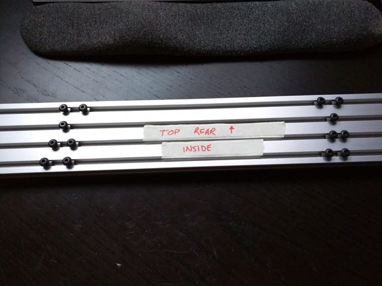
 
 43. Thread M5x10mm button head screws into the 4 holes on each end of the extrusion.
 
     Example: 
 
 44. Set this extrusion aside for later use.
 
 45. Find the 20x80mm extrusion labeled "Top Left" and lay it flat on one of it's 80mm sides in front of you.
 
 46. We will assume this is now the inside of the top rear extrusion and the 20mm side furthest from you is the side that will be at the top of the finished chassis., mark it with the tape and marker.
 
     Example: 
  
 47. Locate Corner Bearing Bracket A, this is a printed part.
 
 48. Place Corner Bearing Bracket A on the right side of the 80mm side facing you with the bearing support hole closest to the edge of the printed part laying flat on the extrusion.  Make sure the printed part is lined up against the right edge with the opposing bearing support hole vertical and flush with the edge.
 
     Example: 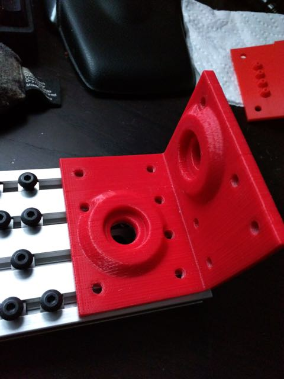
     
 49. Locate the printed extrusion drill guide shown below.
 
     Example: 
 
 50. Place this drill guide under the Corner Bearing bracket and make note of the hole you should be drilling, it will be in the center of the hole in the corner bearing bracket.  It should be the second pilot hole from the bottom on the drill guide.
     
     Example: 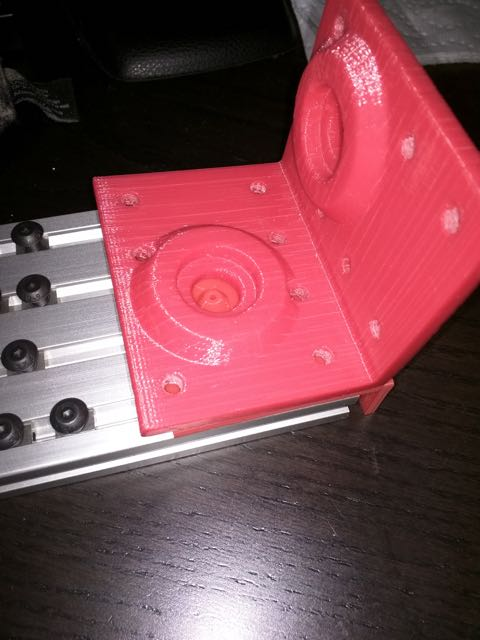
              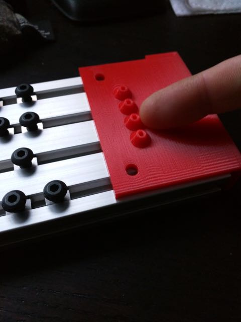
     
 51. Set the Corner Bearing Bracket A aside for later use.
 
 52. Using 4 M5x10mm button head screws secure the drill guide to the right edge of the extrusion.
 
    Example: 
 
 53. Using 2 T-Slot nuts and 2 M5x10mm button head Screws secure the 2 holes on the upper face of the drill guide to the extrusion.
 
    Example: 
 
 54. If you have access to a drill press you would be best served using it for the next drilling steps but a hand drill used carefully will suffice.
 
 55. Drill the top most pilot hole using a small bit.
 
 56. Remove the drill guide and set the screws and T-Slot nuts aside.
 
 57. Using a slightly larger bit (I used a 5mm bit) drill out the pilot hole.
 
 58. Using your 1/2" end mill drill the final hole through the extrusion.
 
     Example: 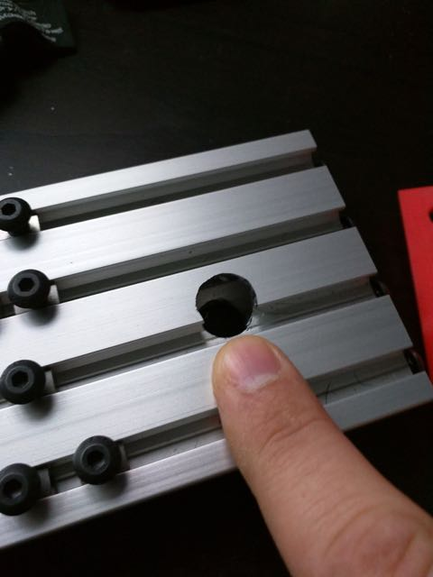
 
 59. At this time you can choose to use a round file to clean up the drilled hole.
 
 60. Locate Corner Bearing Bracket B, this is a printed part.
 
 61. Place Corner Bearing Bracket B on the left side of the 80mm side facing you with the bearing support hole closest to the edge of the printed part laying flat on the extrusion.  Make sure the printed part is lined up against the right edge with the opposing bearing support hole vertical and flush with the edge.
 
     Example: 
     
 62. Locate the printed extrusion drill guide shown below.
 
     Example: 
 
 63. Place this drill guide under the Corner Bearing bracket and make note of the hole you should be drilling, it will be in the center of the hole in the corner bearing bracket.  It should be the second pilot hole from the bottom on the drill guide.
     
     Example: 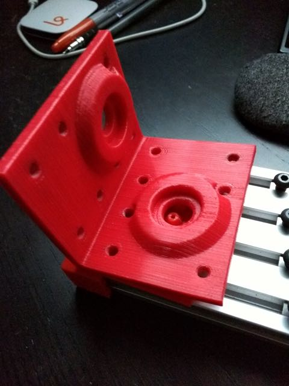
              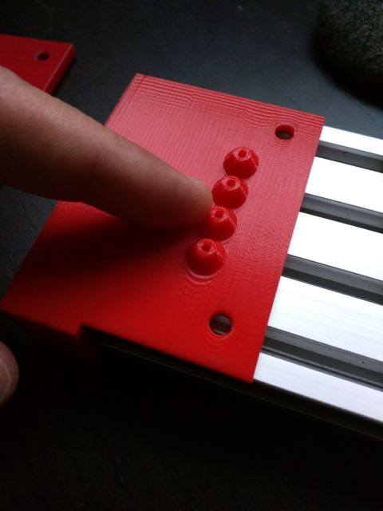
     
 64. Set the Corner Bearing Bracket B aside for later use.
 
 65. Using 4 M5x10mm button head screws secure the drill guide to the right edge of the extrusion.
 
    Example: 
 
 66. Using 2 T-Slot nuts and 2 M5x10mm button head Screws secure the 2 holes on the upper face of the drill guide to the extrusion.
 
    Example: 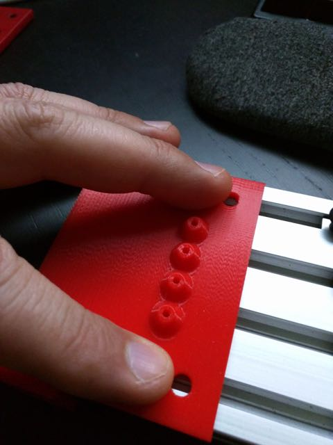
 
 67. If you have access to a drill press you would be best served using it for the next drilling steps but a hand drill used carefully will suffice.
 
 68. Drill the top most pilot hole using a small bit.
 
 69. Remove the drill guide and set the screws and T-Slot nuts aside.
 
 70. Using a slightly larger bit (I used a 5mm bit) drill out the pilot hole.
 
 71. Using your 1/2" end mill drill the final hole through the extrusion.
 
     Example: 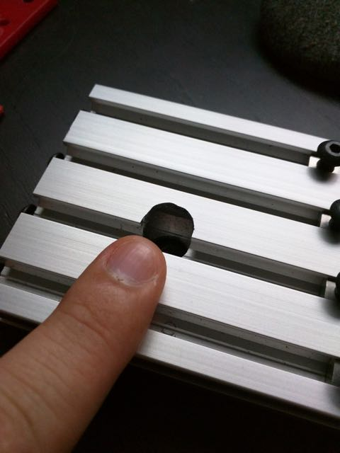
 
 72. Locate the drill guide shown below
 
     Example: 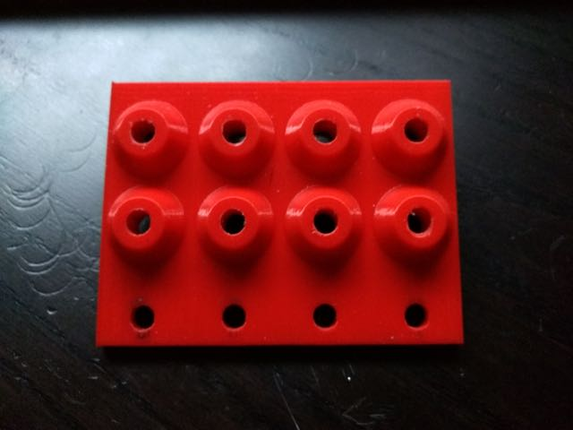
 
 73. With the 20x80mm Top Left extrusion sitting on the table in front of you with the inside side facing up and the 20mm side labeled as the top of the extrusion facing away from you place the drill guide on the bottom edge as shown.
 
     Example: 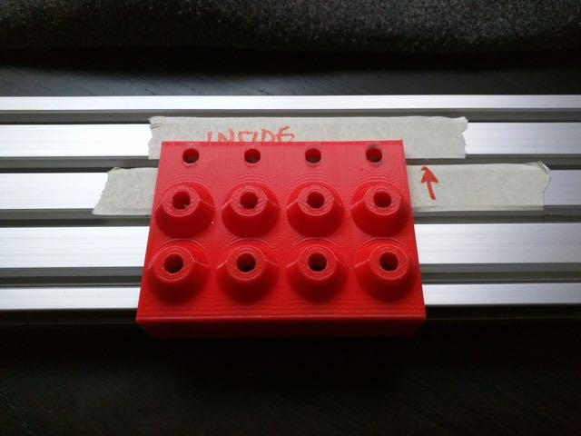
 
 74. Measure **exactly** 215mm from the left edge of the extrusion  and slide the edge of the drill guide to that point.
 
     Example: 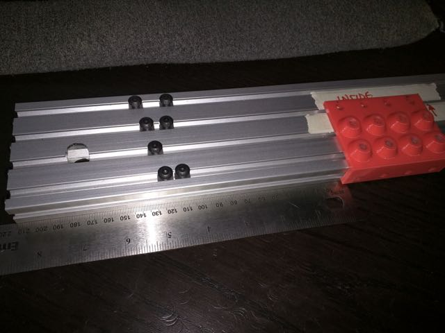
 
 75. Using 4 T-Slot nuts and 1 M5x8mm button head screw per nut secure the drill guide holes on this side taking special care to preserve the 215mm from the left edge.
 
     Example: 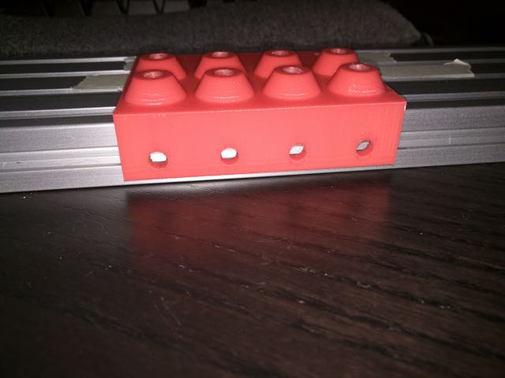
 
 76. You can optionally secure 2 to 4 of the holes on the top side of the drill guide but I've found that it isn't 100% necessary, I did this both ways and the result came out the same.
 
 77. Drill these 4 holes with a 5mm drill bit.
 
     Example: 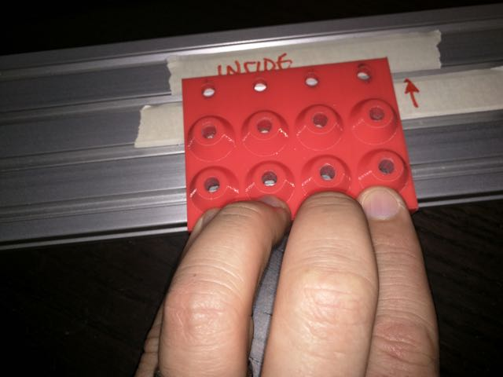
              
 
 78. Place the 20x80mm Top Left extrusion sitting on the table in front of you with the inside side facing up and the 20mm side labeled as the top of the extrusion facing away from you.
 
 79. Locate 4 T-Slot Nuts and 4 M5x8mm button head screws.
 
 80. Thread the 8mm screws into the T-Slot nuts as shown below.
 
     Example: 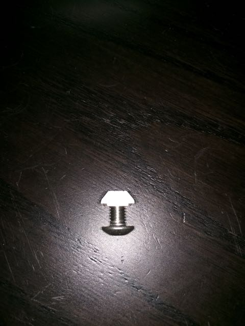
 
 81. In the slot of the extrusion closest to you slide the 4 button head screw tops in like this.
 
     Example: 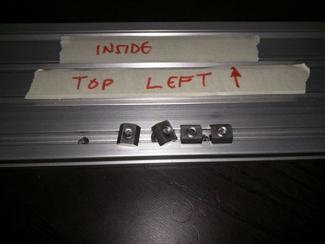
 
 82. On each side of these 4 screws insert 2 T-slot nuts and secure them with 1 M5x10mm button head screw each, hand tightened to keep them from sliding.
 
 83. In the slot above this insert 2 T-Slot nuts and secure them with 1 M5x10mm button head screw each, hand tightened to keep them from sliding.
 
 84. In the slot above this insert 4 T-Slot nuts and secure them with 1 M5x10mm button head screw each, hand tightened to keep them from sliding.
 
 85. In the top most slot insert 4 T-Slot nuts and secure them with 1 M5x10mm button head screw each, hand tightened to keep them from sliding.
 
 86. Thread M5x10mm button head screws into the 4 holes on each end of the extrusion.
 
     Example: 
 
 87. The end result should look like this.
 
     Example: 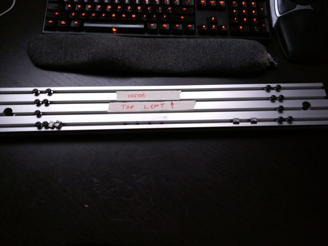
 
 88. Set this extrusion aside for later use.
 
 89. Locate the 20x80mm extrusion marked "Top Right" and lay it flat on one of it's 80mm sides in front of you.
 
 90. We will assume this is now the inside of the top rear extrusion and the 20mm side furthest from you is the side that will be at the top of the finished chassis., mark it with the tape and marker.
 
     Example: 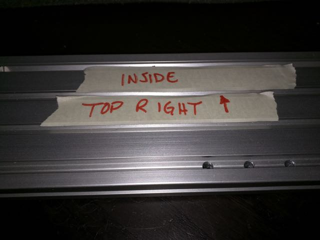
 
 91. Locate the drill guide shown below
 
     Example: 
 
 92. With the 20x80mm Top Right extrusion sitting on the table in front of you with the inside side facing up and the 20mm side labeled as the top of the extrusion facing away from you place the drill guide on the bottom edge as shown.
 
     Example: 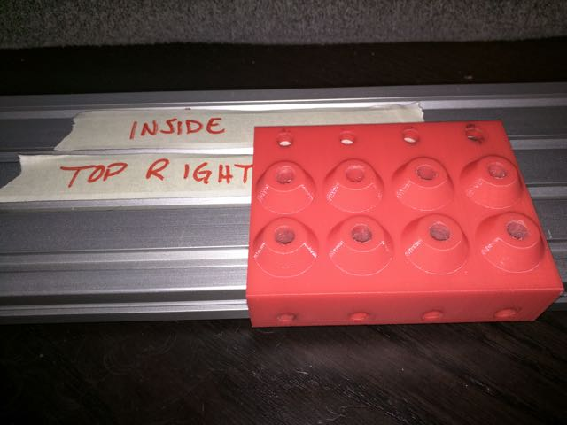
 
 93. Measure **exactly** 215mm from the right edge of the extrusion and slide the edge of the drill guide to that point.
 
     Example: 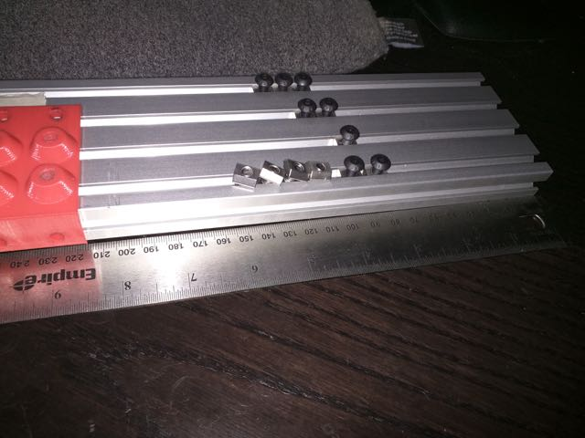
 
 94. Using 4 T-Slot nuts and 1 M5x8mm button head screw per nut secure the drill guide holes on this side taking special care to preserve the 215mm from the left edge.
 
     Example: 
 
 95. You can optionally secure 2 to 4 of the holes on the top side of the drill guide but I've found that it isn't 100% necessary, I did this both ways and the result came out the same.
 
 96. Drill these 4 holes with a 5mm drill bit.
 
     Example: 
              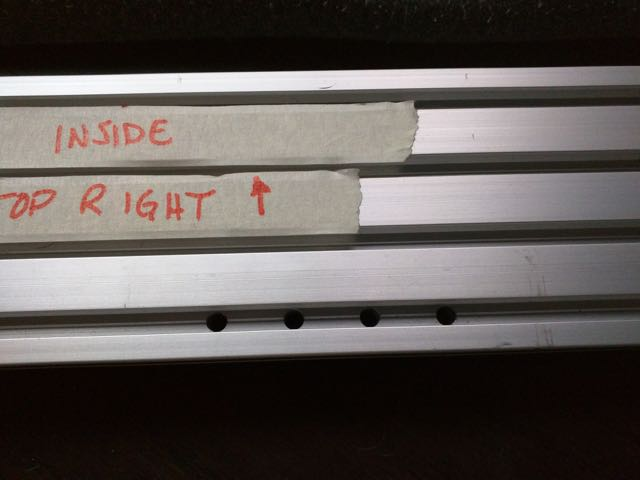
 
 97. Place the 20x80mm Top Left extrusion sitting on the table in front of you with the inside side facing up and the 20mm side labeled as the top of the extrusion facing away from you.
 
 98. Locate 4 T-Slot Nuts and 4 M5x8mm button head screws.
 
 99. Thread the 8mm screws into the T-Slot nuts as shown below.
 
     Example: 
 
 100. In the slot of the extrusion closest to you slide the 4 button head screw tops in like this.
 
     Example: 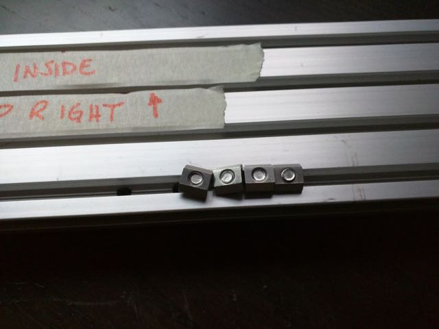
 
 101. On each side of these 4 screws insert 2 T-slot nuts and secure them with 1 M5x10mm button head screw each, hand tightened to keep them from sliding.
 
 102. In the slot above this insert 2 T-Slot nuts and secure them with 1 M5x10mm button head screw each, hand tightened to keep them from sliding.
 
 103. In the slot above this insert 4 T-Slot nuts and secure them with 1 M5x10mm button head screw each, hand tightened to keep them from sliding.
 
 104. In the top most slot insert 6 T-Slot nuts and secure them with 1 M5x10mm button head screw each, hand tightened to keep them from sliding.
 
 105. The end result should look like this.
 
     Example: 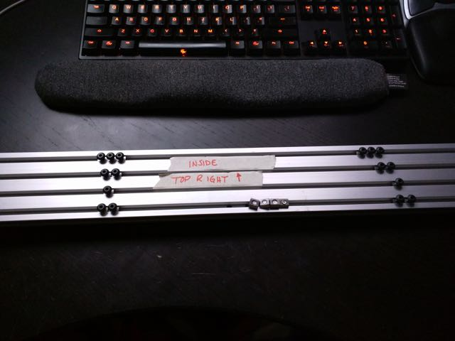
 
 106. Flip the extrusion over so that the outside side is facing up.
 
      Example: 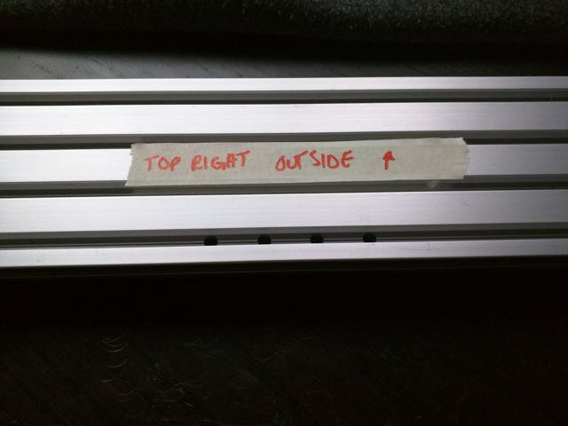
 
 107. In the slot closest to you, the bottom most slot, insert 5 T-Slot nuts and secure them with 1 M5x10mm button head screw each, hand tightened to keep them from sliding.
 
 108. In the top most slot on the outer side insert 5 T-Slot nuts and secure them with 1 M5x10mm button head screw each, hand tightened to keep them from sliding.
 
 109. Thread M5x10mm button head screws into the 4 holes on each end of the extrusion.
 
     Example: 
 
 110. The end result should look like this.
 
      Example: 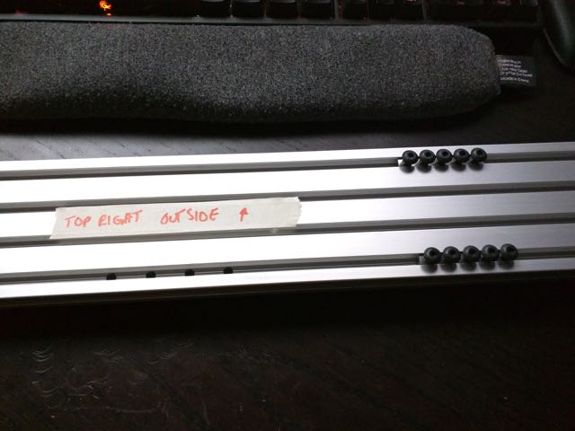
 
 110. Set this extrusion aside for later use.

## Power supply and switch plate

 1. Locate the printed part "Outlet Switch and Network Mount" and the Electrical fused plug part ordered from the BOM.
 
    Example: 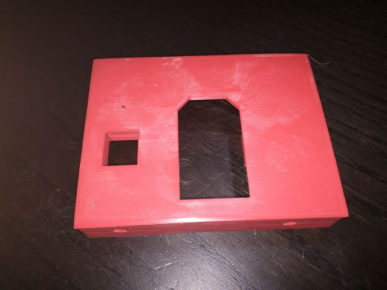
 
 2. Slide the fused plug into the outlet switch and network mount printed part.
 
    Example: 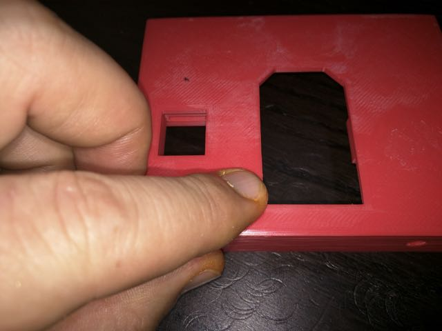
 
 3. Mark the hole on either side of the fused plug for drilling and remove the fused plug from the printed part.
 
 4. Using a 3mm or equivalent drill bit, drill the 2 holes.
 
 5. Slide the fused plug back into the outlet switch and network mount plate and line up the holes in the fused plug with the drilled holes.
 
 6. Using an M3x12mm socket cap screw and an M3 lock nut secure the fused switch to the printed part for each hole.
 
    Example: 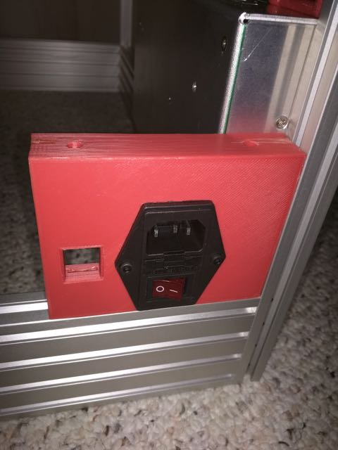
 
 7. On the "Bottom Right" 20x80mm extrusion remove 2 of the M5x10mm button head screws from the 2 T-slot nuts closest to the right rear corner.
 
 8. Slide all T-Slot nuts out of the way of the rear corner to make it easier to slide them into place later.
 
 9. With the outlet switch printed part laying down on a flat surface with the switch side up, locate the 2 holes on the right side.
 
    Example: 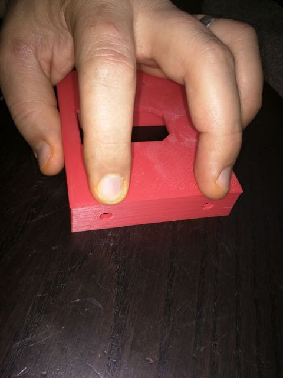
 
 10. Insert 1 M5x8mm button head screw in each hole from the inside.
 
     Example: 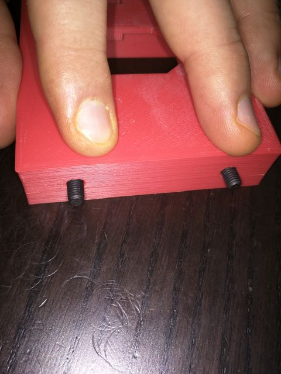
 
 11. Thread 1 T-Slot nut on each screw to prepare the switch for securing into the rear right corner 20x20mm vertical extrusion.
 
     Example: 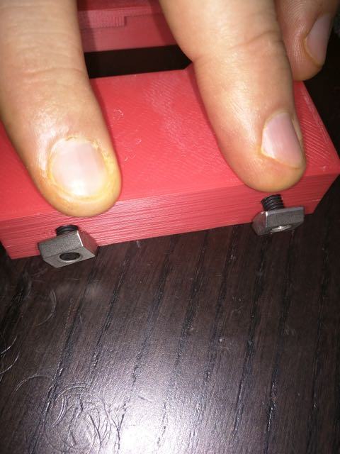
 
 12. Slide the T-Slot nuts in the rear right vertical extrusion on the face that is facing the front of the chassis.
 
     Example: 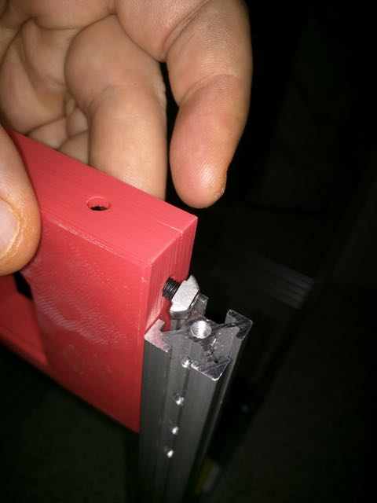
 
 13. Slide the printed part all the way down to the bottom and secure the 2 button head screws from the inside.
 
 14. Using a long hex wrench slide 1 T-Slot nut under the outlet switch and network mount printed part until it lines up with the rear most hole.
 
 15. Use 1 M5x8mm button head screw to secure this T-Slot nut.
 
 16. Repeat steps 14-15 for the other bottom hole of the outlet switch mount.
 
     Example: 
 
 17. Locate the power supply and 3 printed power supply brackets.
 
     Example: 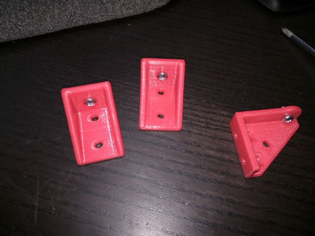
 
 18. Place the power supply laying flat on a surface in front of you with the fan side down and the terminal side facing left.
 
 19. Using an M4x10mm screw secure the side of the 2 identical printed brackets to the bottom side of the power supply. This will be the side facing you.
 
     Example: 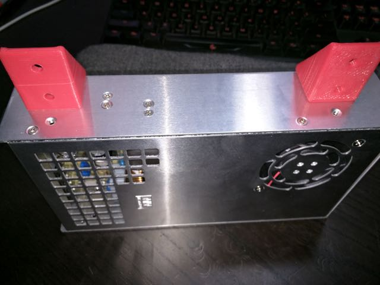
 
 20. In the remaining power supply bracket insert 1 M5x8mm button head screw into each of the 2 holes on the extrusion mount side. Thread a T-Slot nut on each screw.
 
     Example: 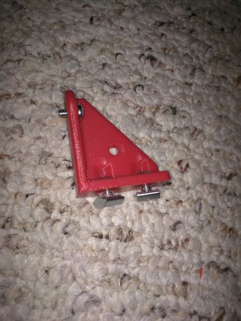
 
 21. On the side of the power supply facing away from you, top side, use an M4x8mm screw to secure the remaining printed bracket to the power supply.
 
     Example: 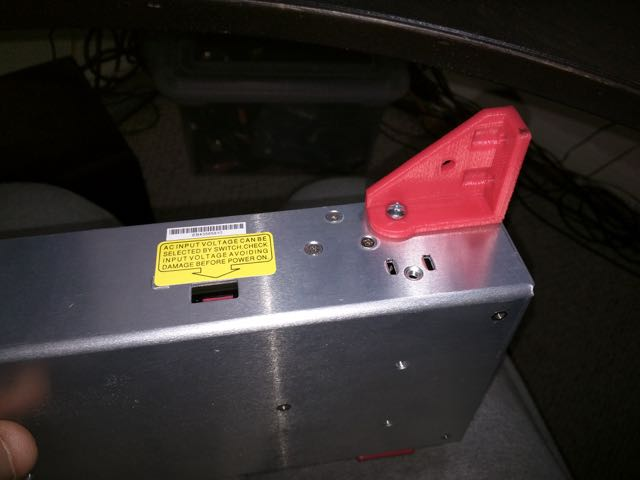
 
 22. Begin installing the power supply by sliding the 2 threaded T-Slot nuts into the rear right vertical extrusion on the left side of the extrusion.
 
     Example: 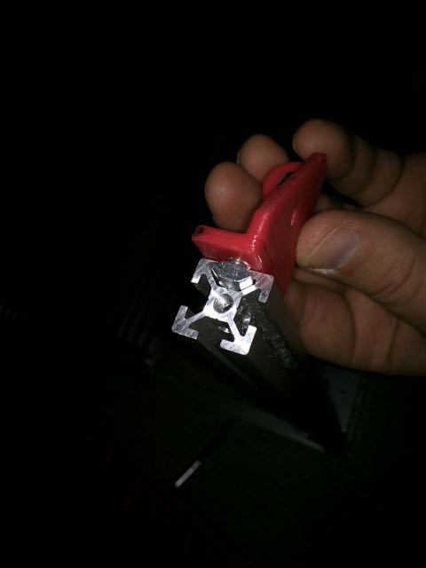
              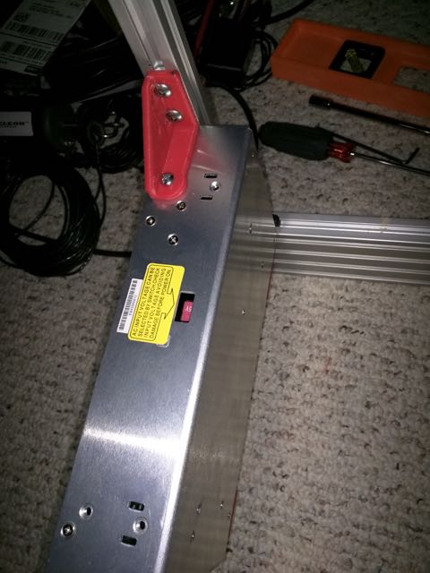
 
 23. Now is a great time to check the input voltage.  For the US set the switch to 115V.
 
     Example: 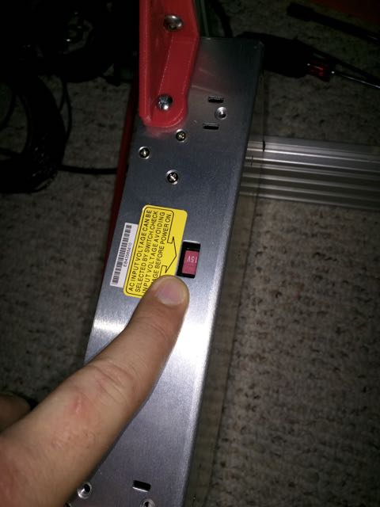
 
 24. Using the T-Slot nuts installed in the front face of the rear bottom extrusion secure the remaining power supply brackets.
 
     Example: 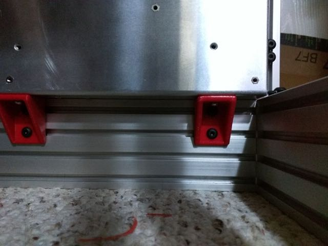
 
## Z-Gantry

 Parts needed:
    * 8 Openbuilds V-Slot wheel kits
    * 8 1/4" eccentric spacers
    * 8 M5x25mm button head screws
    * 8 M5 15mm OD washer
    * 2 Delrin lead screw nuts (See BOM for part number)
    * 2 12mm lead screws (See BOM for part number")
    * 4 608ZZ bearings
    * 4 8mm shim washers
    * 4 M5x25mm socket head cap screws
    * 4 M5x16mm button head socket cap screws
    * 2 36 tooth pulleys
    * 2 Z Leadscrew top bearing holders
    * 2 Z Leadscrew bottom bearing holders
    * 8 M5x8mm button head screws
    * 4 M5x10mm button head screws

 1. Locate the 2 Z-Gantry angle plates.
 
 2. Using the drawings below, make the necessary cuts and holes to both Z-Gantry Plates.
 
    Drawings: 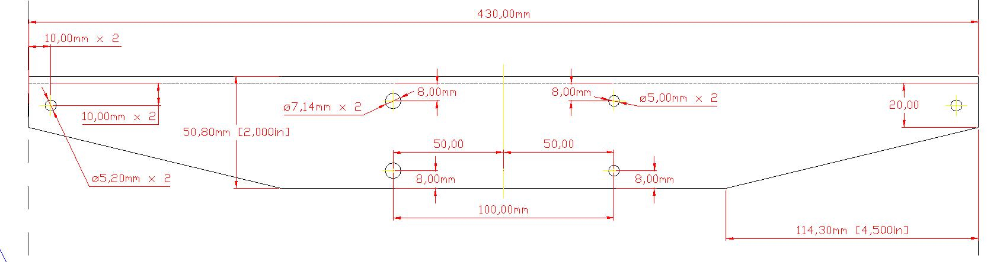
              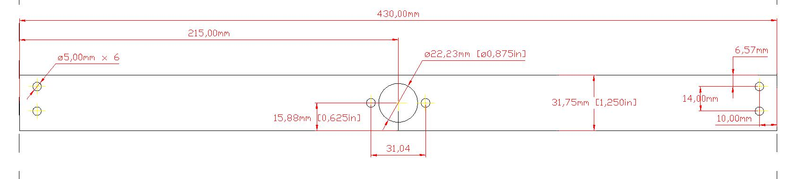
 
 3. This would be a great time to paint the plates if you want to.
 
    Example: 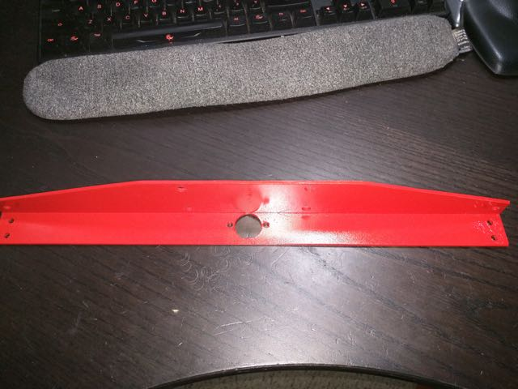
 
 4. Set one plate aside.
 
 5. With one Z gantry angle plate drilled and prepped (optionally painted) locate 1 M5x25mm button head screw, 1 V-Slot wheel kit 1 M5 15mm OD washer and 1 1/4" eccentric spacer.
 
 6. Assemble the wheel assembly as shown below.
 
    Assembly: 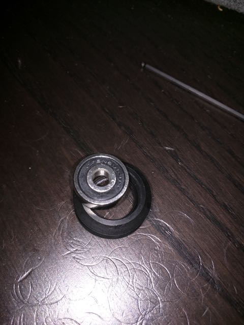
              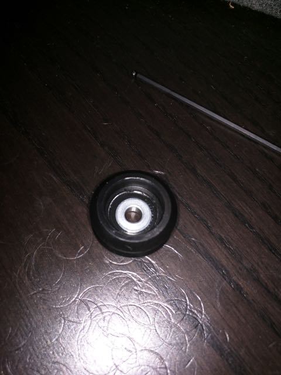
              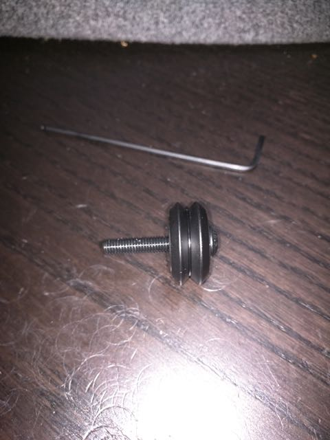
              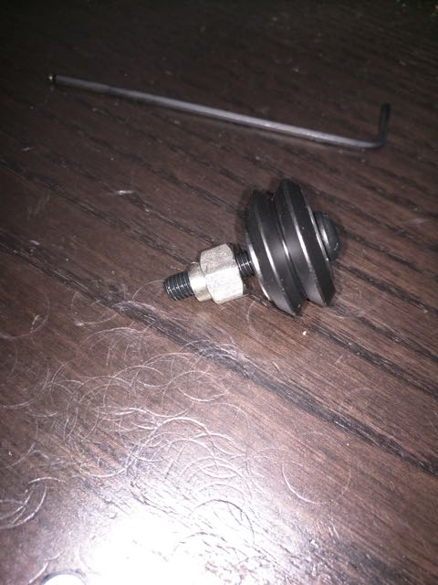
              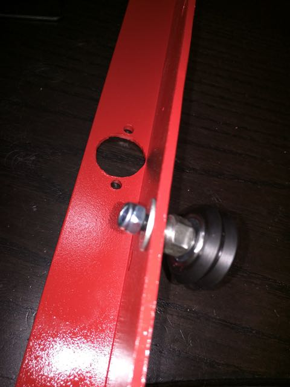
 
 7. Tighten down the wheel assembly on the z gantry plate until it's snug but still can be adjusted with a box end wrench.
    
 8. Repeat this process for all 4 wheel mounting holes but before tightening down one of the top wheels insert the printed Z end stop tab. Pay attention to which wheel you are putting this on to be sure you want your Z end stop mounted on that side of the Z uprights..
 
    Example: 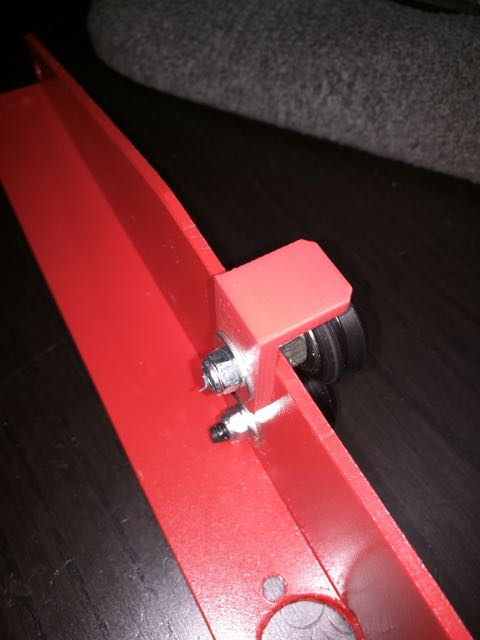
 
 9. Using a bubble level and a box end wrench that fits your eccentric spacer balance the Z gantry plate.  This can take quite a while so be patient and make sure things are level.
 
    Example: 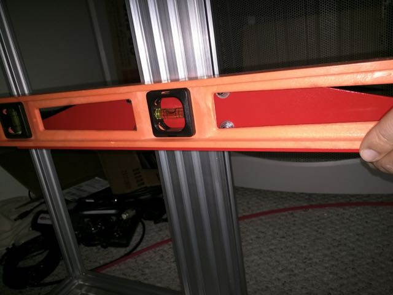
             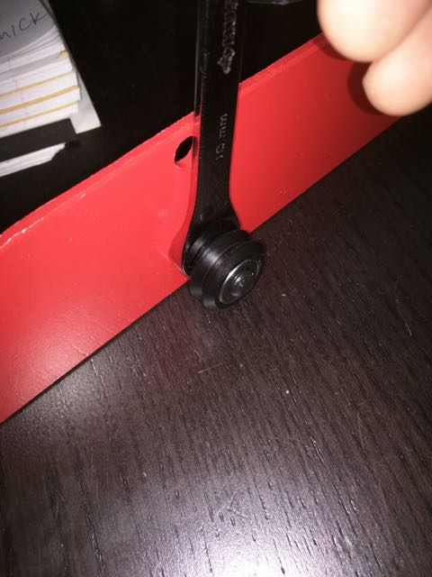
             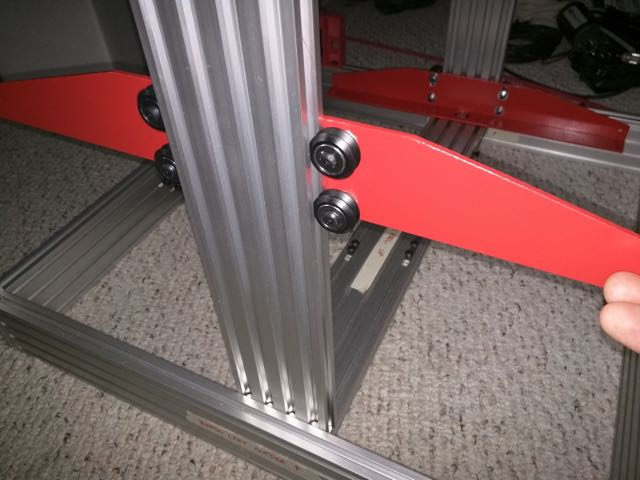
             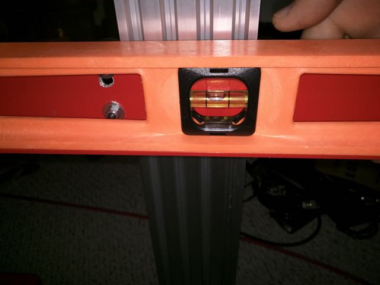
 
 10. Repeat steps 5 through 9 for the other gantry plate.
 
 11. Locate the 2 20x20mm extrusions measuring 519.5mm in length.
 
     Example: 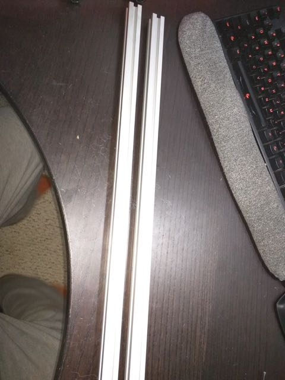
 
 12. Tap each of the end holes on these 2 extrusions using your M5 x .8mm thread tap.
 
 13. Set one extrusion aside for later.
 
 14. Locate 1 M5x10mm button head screw and 1 oversized M5 washer (15mm OD)
 
 15. Line an extrusion up with the single hole at the end of one of the Z gantry plates and thread the screw through the washer, then the gantry plate hole and finally into the end of the 20x20mm extrusion.
 
     Example: 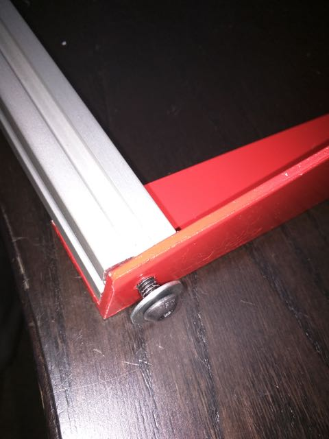
 
 16. Tighten but only until slightly snug.
 
 17. Insert 2 T-Slot nuts in the bottom slot of the extrusion
 
     Example: 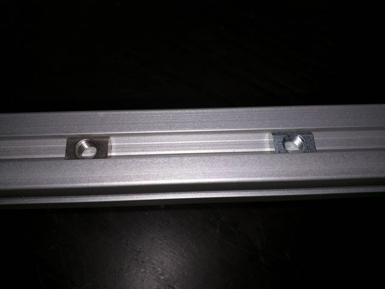
 
 18. Line these up with the 2 holes in the bottom of the z gantry plate.
 
 19. Thread 1 M5x8mm button head screw through an M5 washer (not oversized)
 
 20. Insert this screw into one of the holes on the bottom of the z gantry plate and into the T-Slot nut.  Snug the connection down but not tight.
 
     Example: 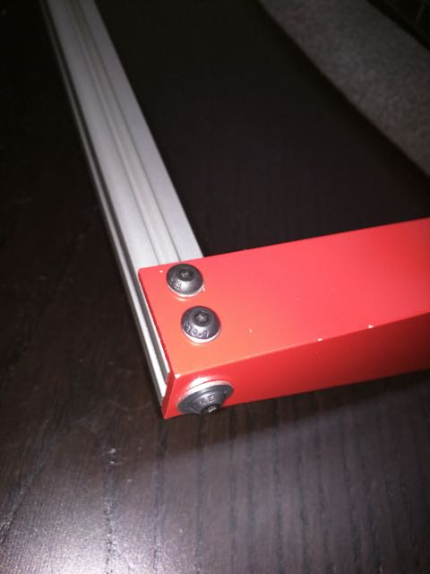
 
 21. Repeat steps 19-20 for the other hole in the Z gantry plate on that side.
 
 22. Repeat steps 14 - 21 for the other side of the gantry plate.
 
 23. Insert 2 more T-Slot nuts in the bottom of each 20x20mm extrusion for the other gantry plate.
 
 24. Repeat steps 14-22 for the other gantry plate.
 
 25. Tighten down all of the screws to complete the Z gantry plate/extrusion assembly.
 
     Example: 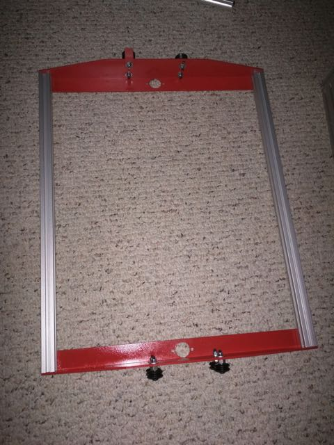
              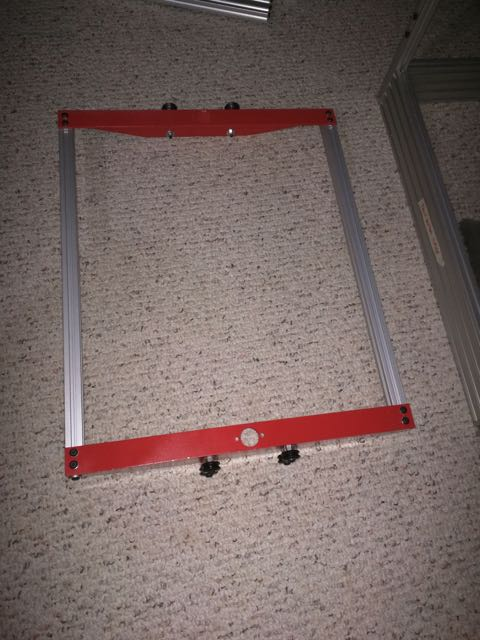
 
 26. Locate 1 Delrin leadscrew nut, 2 M5x16mm button head screws, 2 M5 lock nuts and 4 M5 standard washers.
 
     Example: 
 
 27. Place 1 washer on each button head screw and feed each screw through a small hole in the center of one of the gantry plates.
 
     Example: 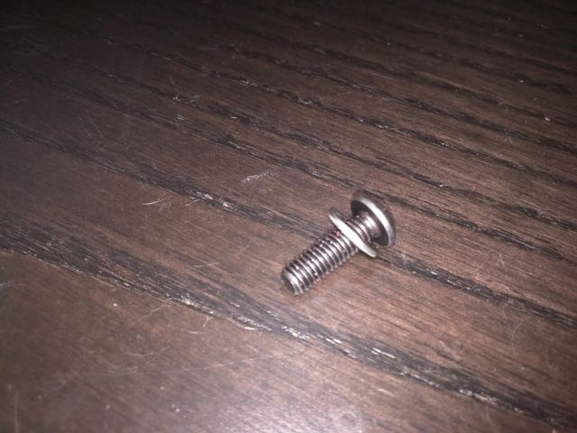
              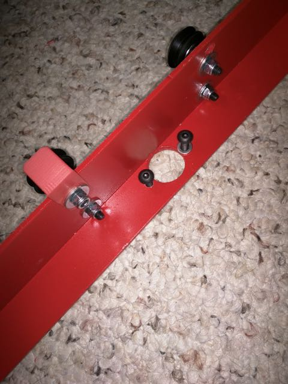
 
 28. Feed the long end of the delrin nut through the gantry plate's big hole between the 2 screws aligned with the screws and seat it firmly.
 
     Example: 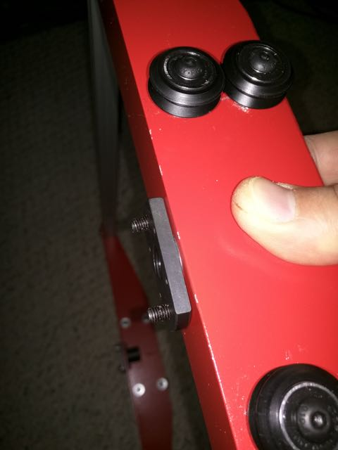
 
 29. Using the remaining 2 washers and lock nuts secure the delrin leadscrew nut but do not tighten things down yet.
 
     Example: 
 
 30. Repeat steps 27-29 for the other Z-Gantry plate.
 
 31. Print the heat spreader template and tape it together taking care to make sure the lines are aligned properly.  Make sure you print it raw and do not fit to page.
 
     Template: [Heat Spreader Template](./Templates/Aluminum_Heat_Spreader_Paper_Template.pdf)
     
     Example: 
     
 32. Tape the heat spreader template down to the heat spreader and use the template to place your center punch to mark each hole.
 
 33. Drill each hole with a 5mm drill bit.
 
 34. Place the aluminum heat spreader into the mdf insulator board and use the heat spreader as a drill guide to drill the insulator board.
 
 35. Align the holes in the insulator board and heat spreader with the 519.5mm 20x20mm extrusions of the Z-Gantry.  Center the insulator board between the 2 gantry plates and clamp them together.
 
 36. Using the insulator and heat spreader as a drill guide, drill the 5mm holes in the 4 corners of the heat spreader.
 
 37. Remove the clamps and lay the heat spreader on a flat surface.
 
 38. Using a countersinking bit or a larger drill bit that is wider than the head of the M5 flat head screws drill countersinks for all 6 holes of the heat spreader. Make sure that the countersink is deep enough to keep the head of the flat head M5 screws below the surface of the aluminum heat spreader or you risk cracking the corner of the glass that clips on top.
 
     Example: 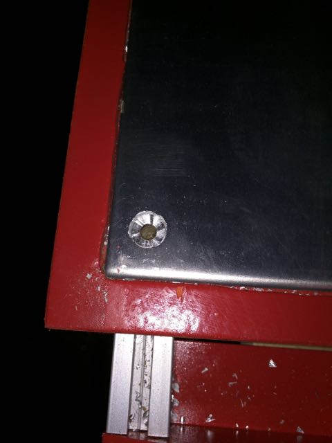
              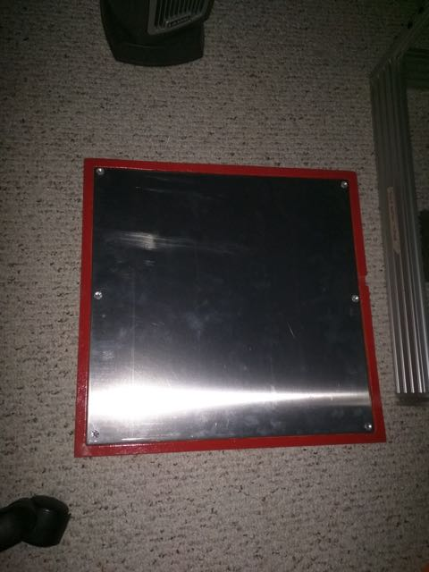
 
 39. Using a larger bit than the original 5mm, I'd say 6 or 7mm, drill out the 4 holes in the 519.5mm 20x20 extrusions to allow the heated bed adjustment to move without binding.
 
 40. Set the gantry assembly aside for now.
 
 41. Locate 4 M5x70mm flat head hex screws, 2 M5x30mm flat head hex screws, 6 M5 nylon lock nuts and 6 M5 oversized washers (15mm OD)
 
     Example: 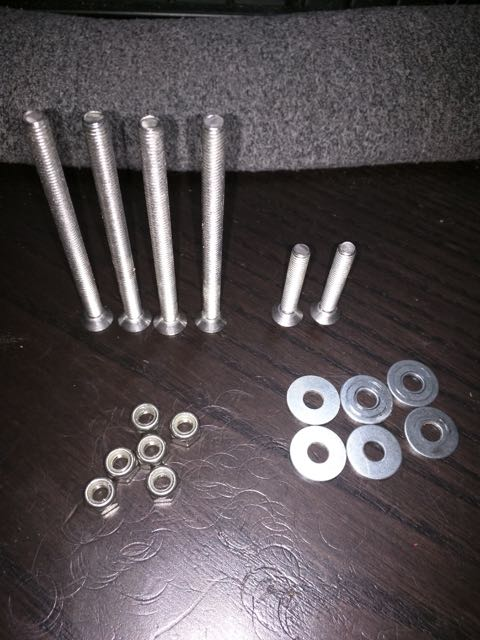
 
 42. Lay the MDF insulator board flat with the top of the board facing up.  
 
 43. Position the 380mm square silicone heater in the center of the insulator board with the adhesive side up.
 
 44. Remove the adhesive backing.
 
 45. Thoroughly clean the back side of the aluminum heat spreader to ensure proper adhesion.
 
 46. Place the aluminum heat spreader on top of the heater pad taking great care to align the holes of the heat spreader with the holes in the insulator board.
 
 47. Press down firmly all over the heat spreader to ensure you have adhesion of the silicone heater to the aluminum heat spreader.
 
 48. Select one corner of the aluminum heat spreader and insert 1 M5x70mm flat head screw through the 5mm hole.
     
     Example: 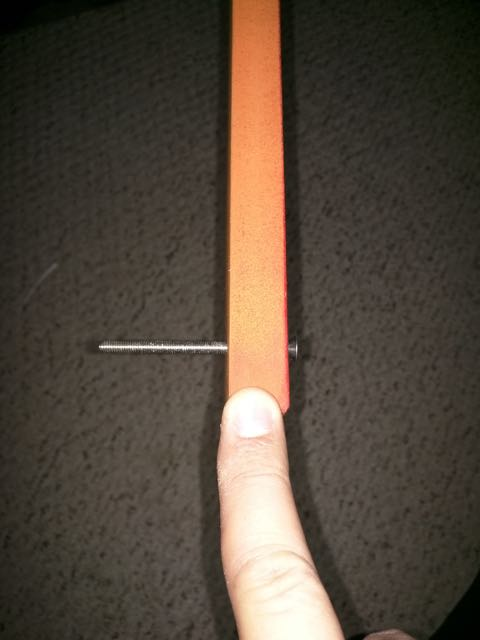
     
 49. On the back side of the MDF insulator board slide 1 M5 oversized washer over the end of the screw and seat it against the MDF insulator board.
 
     Example: 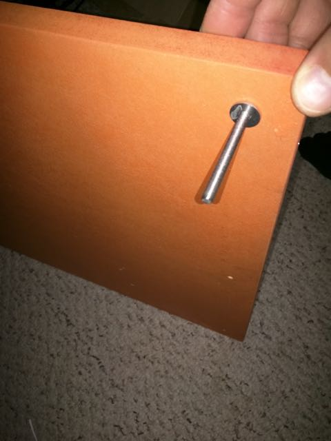
 
 50. Thread one M5 nylon lock nut on the end of the screw and tighten down.
 
     Example: 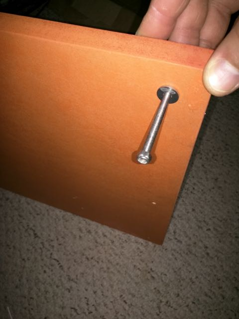
              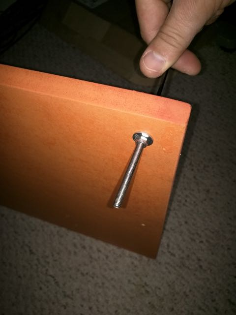
 
 51. Repeat steps 48 - 50 for each of the other 3 corners of the aluminum heat spreader.
 
 52. Select one of the middle holes in the heat spreader.
 
 53. Insert 1 M5x30mm flat head screw through the hole.
 
     Example: 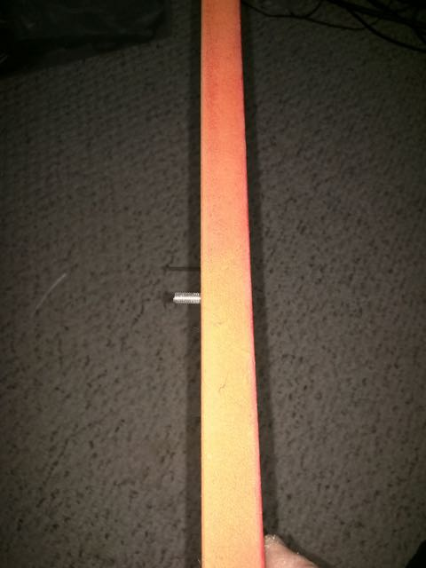
 
 54. On the back side of the MDF insulator board slide 1 M5 oversized washer over the end of the screw and seat it against the MDF insulator board.
 
     Example: 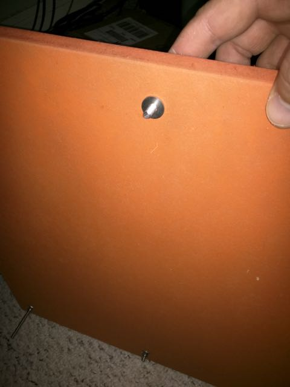
 
 55. Thread one M5 nylon lock nut on the end of the screw and tighten down.
 
     Example: 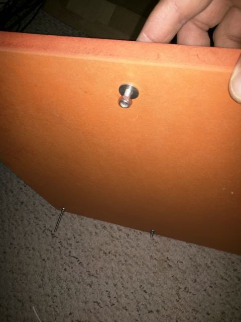
              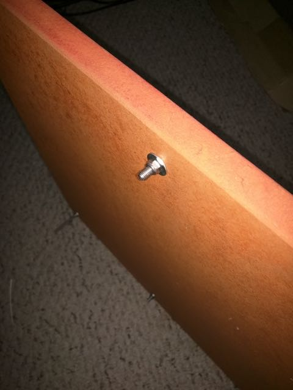
 
 56. Repeat steps 52 - 53 for the other middle hole of the aluminum heat spreader.
 
 57. Set this assembly aside for later use.
 
 58. Locate the printed parts "Z Leadscrew Bearing Holder Base" and "Z Leadscrew Bearing Holder Top", there should be 2 of each.
 
 59. Insert 1 608ZZ 8x22x7 bearing in each piece.
 
     **TIPS**
     
      * If the bearing won't fit because the hole it too tight then use a q-tip and acetone to wet the inside walls of the seating surface.  Repeat this until the walls are soft enough to allow you to press fit the bearings.
      * If the bearing fits but is loose then use thin kapton tape wrapped around the bearing evenly to shim the bearing into the holder.
    
    Example: 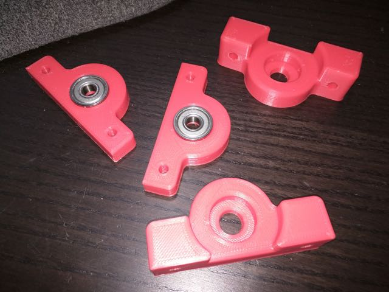
 
 59. Locate:
      * Z-Gantry assembly
      * 2 36 tooth GT2 pulleys
      * 4 8mm shim washers
      * 2 12mm leadscrews
      * 2 delrin leadscrew nuts
      * 12 M5 standard washers
      * 4 M5x25mm socket cap screws
      * 8 M5x16mm button head screws
      * 4 M5 nylon lock nuts
      * 1 1164mm loop GT2 Belt
     
     Example: 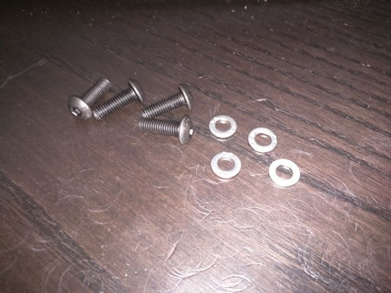
              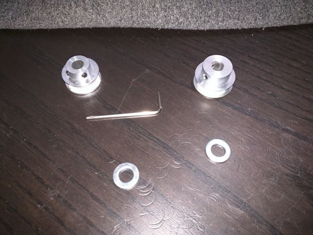
              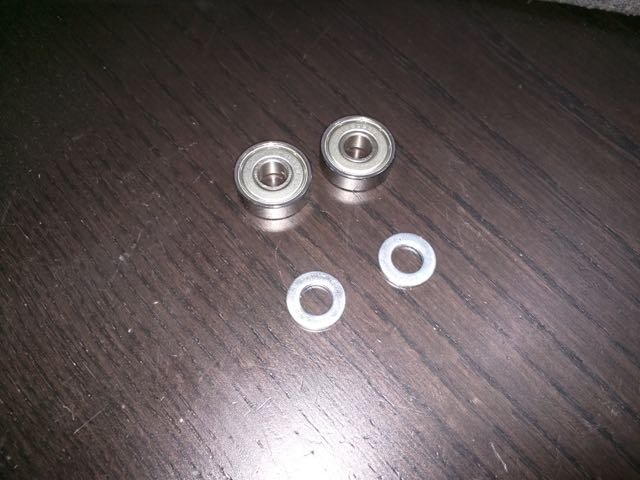
              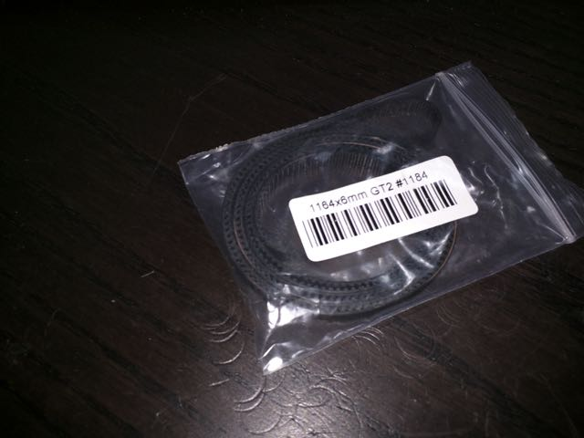
     
 60.  Starting at one side of the inside cross piece loosen one of the M5x10mm screws from the outer slots on the top of the cross piece. Set the screws aside as they aren't used here and were just being used to hold the T-Slot nuts in place.
 
 61. Place a Z Axis bottom bearing holder about 1 to 2mm from the corner of the cross piece and the V-Slot extrusion.
 
     Example: 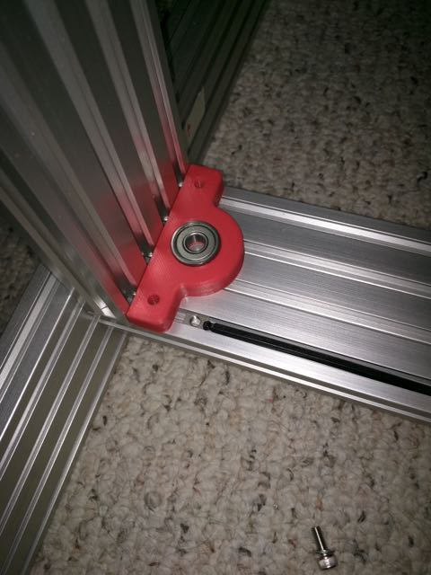
  
 62. Place 1 M5 standard washer on 1 M5x16mm button head screw.
 
 63. Using a hex wrench or similar tool, slide a T-Slot nut under the bearing holder and line up the threads with the hole in the bearing holder.
 
 64. Insert the M5x16mm screw into the hole and tighten.
 
     Example: 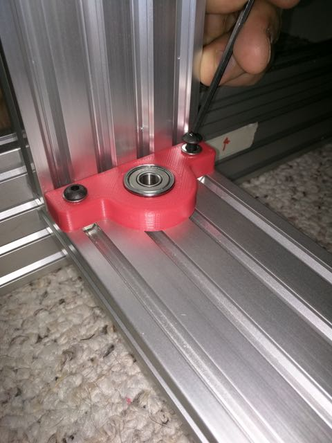
 
 65. Repeat steps 62 for the other hole in the bearing holder.
 
 66. Repeat steps 60 - 65 for the other side of the cross piece.
 
     Example: 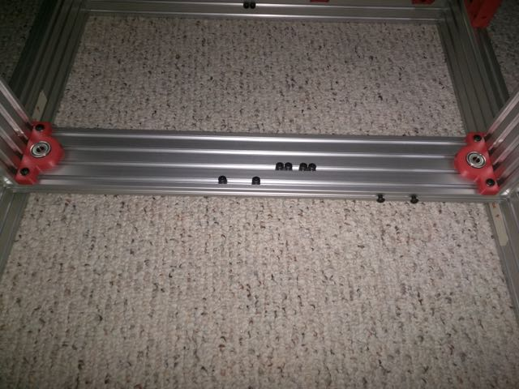
 
 67. Place 1 M5 standard washer on 1 M5x16mm button head screw.
 
 68. Insert a delrin leadscrew nut through the large hole on one side of the Z-Gantry assembly with the cylinder portion of the of the leadscrew nut passed through the bottom of the large hole in the gantry plate.
 
     Example: 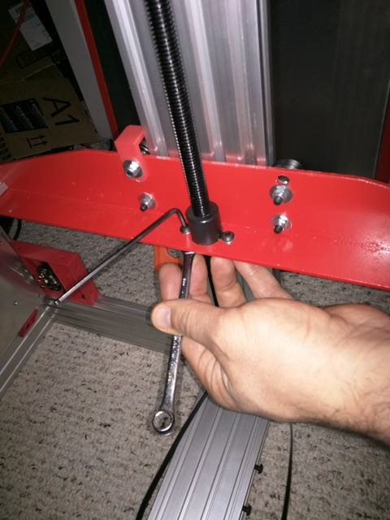
 
 69. Insert the M5x16mm screw with washer through one of the top holes to secure the delrin leadscrew nut.
 
 70. Place a washer on the other side of the gantry plate on the screw passed through and use 1 M5 nylon lock nut to secure the screw but do not tighten just yet.
 
 71. Repeat steps 67 - 70 for the other screw hole of the leadscrew nut.
 
 72. Repeat steps 67 - 71 for the other side of the gantry assembly.
 
 73. Thread one 12mm leadscrew through one of the delrin leadscrew nuts with the longer tapered side facing the bottom of the Z-Gantry plate.  Thread this about halfway.
 
 74. Repeat step 73 for the other side of the gantry assembly.
 
 75. Slide one 36 tooth GT2 pulley on the longer tapered side of one of the lead screws with the collar facing the Z-Gantry assembly and tighten snugly.
 
 76. Repeat step 75 for the other leadscrew.
 
 77. Place 1 8mm shim washer on each of the bearings secured to the lower bearing holders mounted on the center cross piece of the main chassis.
 
 78. Holding the Z-Gantry assembly with the leadscrews inserted and the pulleys facing down slide the assembly onto the V-Slot aligning the wheels.  Feed the leadscrew through the 1164mm GT2 closed loop belt and then feed the remaining tapered end of each leadscrew through the 8mm shim washer and into the bearing underneath.
 
 79. Place 1 M5 standard washer on 1 M5x25mm socket head screw, repeat this for one more M5x25mm screw.
 
 80. Feed these screws through each of the holes of one of the Z axis top bearing holders.
 
 81. Secure 1 T-Slot nut on the end of each of the M5x25mm screws.
 
 82. Place 1 8mm shim washer on the top of the lead screw feeding the short tapered end of the lead screw through the hole of the washer.
 
 83. Feed the remaining portion of the taper through the bearing hole of the Z-Axis top assembly with the flat side of the bearing holder facing the V-Slot. As you are doing this you will need to take special care to feed the T-Slot nuts threaded on the M5x25mm screws into the left and right most slots of the V-Slot extrusion.
 
 84. Tighten the 2 M5x25mm socket head screws to firmly affix the top bearing holder to the V-Slot.
 
 85. Repeat steps 79 - 84 for the other side of the Z-Gantry/leadscrew.
 
     Example: 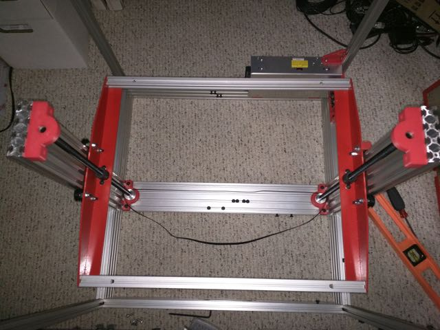
              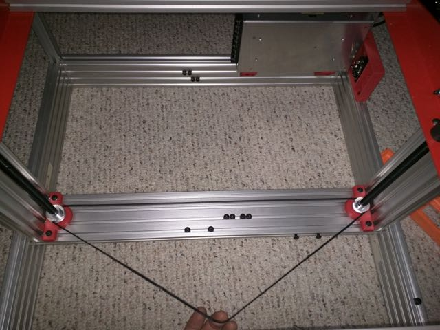
 
 86. Tighten the screws on each side of the leadscrew nuts.
 
     
 
 87.  Align the belt with the 2 36 tooth pulleys.
 
 88. Use a bubble level to ensure that the Z Gantry is level.  This is essential before testing the z axis for binding. If the Z gantry is off level manually spin one of the lead screws to bring it into level.  If the leadscrew won't turn you have binding.  See the next step for tips.
 
 89. Level the Z axis. The Z axis must be level in all directions in order to spin freely.  The following are tips for leveling your Z axis.
    
      * If you have binding on either leadscrew, loosen the 2 screws holding the leadscrew nut to the Z gantry plate.
      * You can use a magnetic bubble level attached to the leadscrews to square them up.
      * The if you have lateral binding of the leadscrews to the left and right side you can loosen the bearing blocks at the bottoms and move them closer or further away from the V-Slot.
      * In some cases (when the Z Gantry holes for the delrin nut aren't true) you will need to sand material off of the seating surface of either the top or bottom bearing holders.
 
 90. Locate 1 printed motor mount, 1 nema 17 stepper motor, 4 M3x8mm button head screws and 4 M3 standard size washers.
     
     Example: 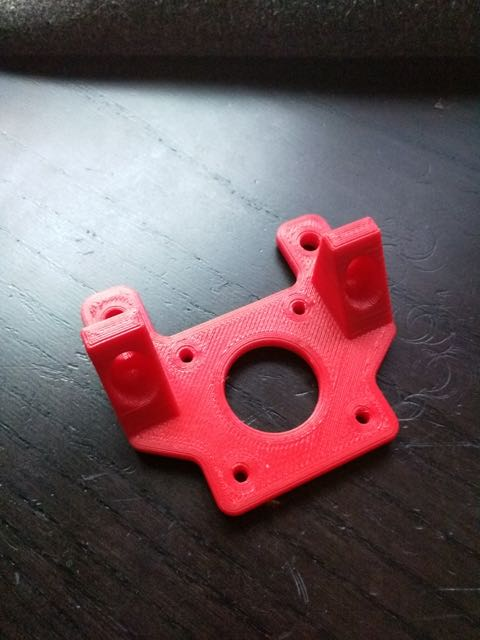
              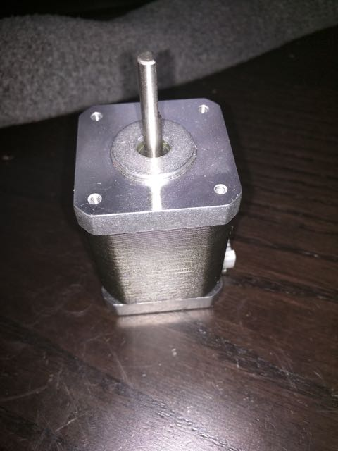
              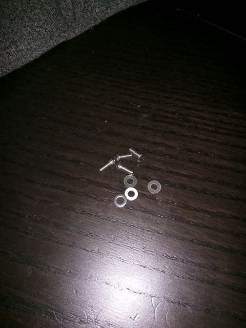
 
 91. Place the motor mount on top of the nema 17 motor as shown below.  Make sure that you pay close attention to the orientation of the wiring harness or plug on one side of the stepper motor.
 
     Example: 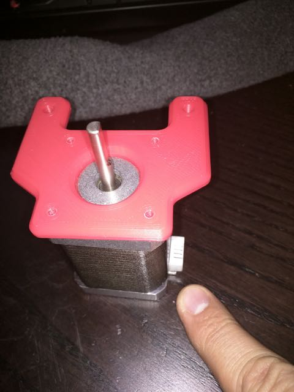
    
 92. Place 1 M3 standard washer on 1 M3x8mm button head screw.
    
     Example: 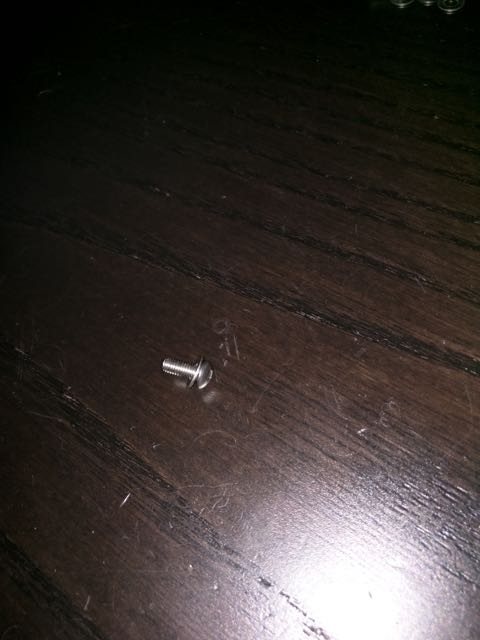
 
 93. Insert the screw from step 91 into one of the holes of the motor mount and secure it to the stepper motor underneath.
 
     Example: 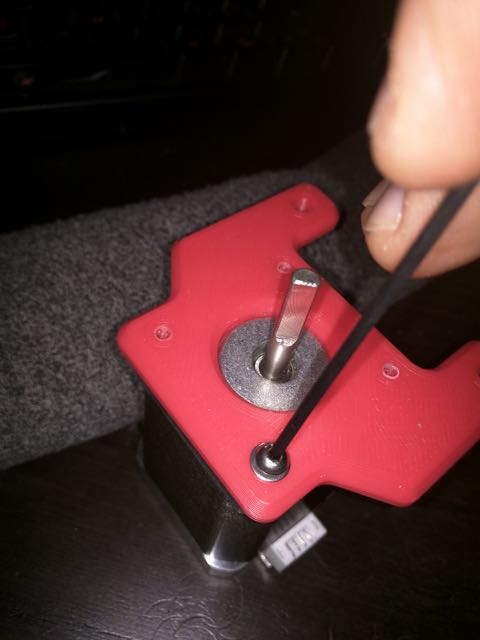
 
 94. Repeat steps 92 - 93 for the remaining 3 holes of the motor mount.
 
     Example: 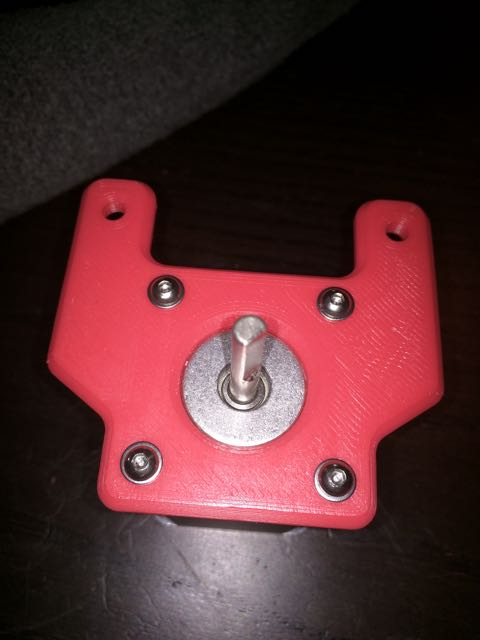
 
 95. Locate these screws and T-slot nuts you inserted into the front slots of the center support.
 
     Example: 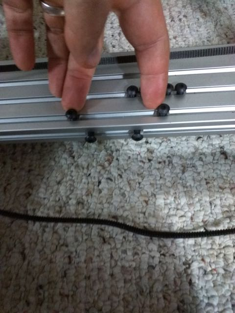
 
 96. Remove the M5x10mm button head screws that were used to hold the T-Slot nuts in place.
 
     Example: 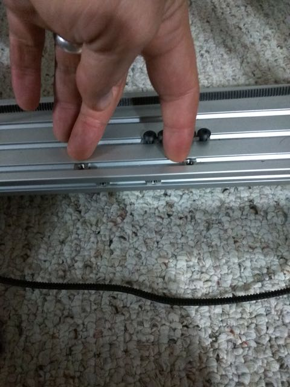
 
 97. Place the motor mount on the center support as shown in the picture below.
 
     Example: 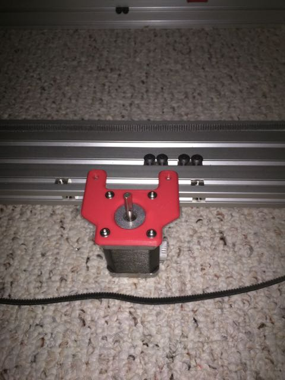
 
 98. Using a hex wrench slide a T-Slot nut under one of the top holes in the motor mount.
 
     Example: 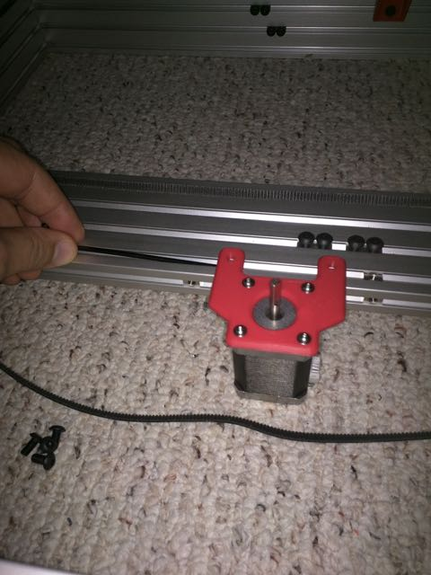
     
 99. Locate 1 M5 standard washer and reuse one of the M5x10mm button head screws previously removed from the T-Slot nuts.  Install the washer on the screw.
 
     Example: 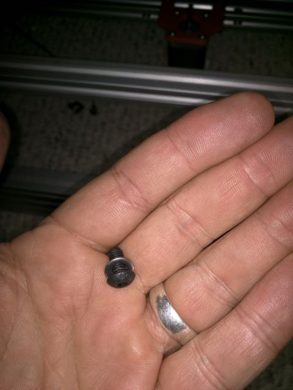
     
 100. Thread the screw through the motor mount and into the T-Slot nut underneath.  Tighten the screw.
 
 101. Repeat steps 98 - 100 for the other top hole of the motor mount.
 
      Example: 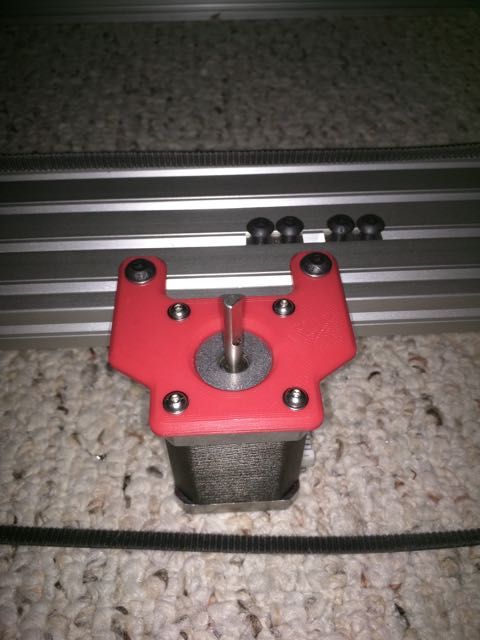
 
 102. Using a hex wrench, slide a T-slot nut behind one of the holes on the motor mount that sits flush with the front of the center support.
 
 103. Locate 1 M5 standard washer and 1 M5x16mm button head screw. Install the washer on the screw.
 
 104. Thread the screw through the hole that you positioned the T-Slot behind and tighten it.
 
 105. Repeat steps 102 - 104 for the other hole in the motor mount.
 
      Example: 
      
 106. Locate the 2 printed parts Z Idler slide support, 4 M5 standard washers, 2 idler pulley kits, 1 20 tooth GT2 pulley, 2 M5x10mm button head screws and 2 M5x25mm socket cap screws
 
      Example: 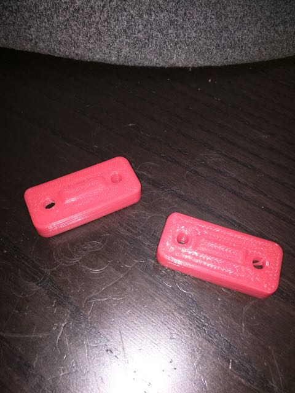
               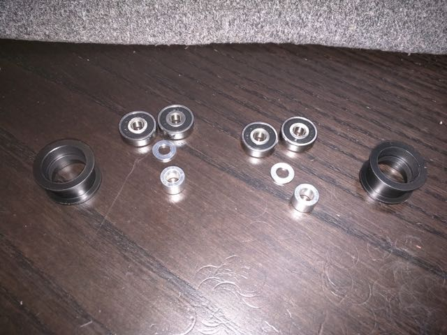
               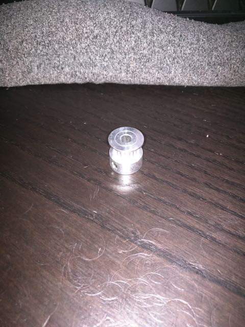
               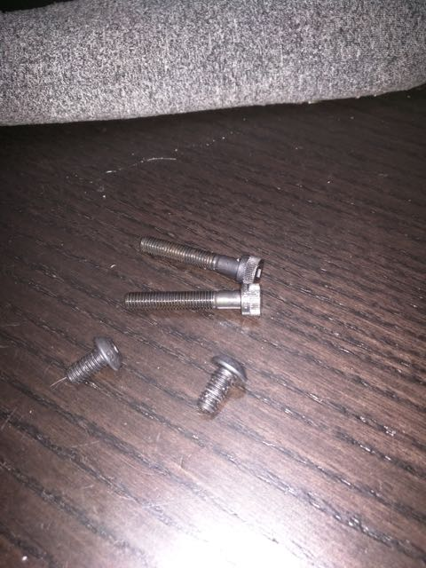
               
 107. Assemble the idler pulleys by press fitting one bearing into one side of the pulley.  Flip the pulley over and insert the nylon space in the center, aligning it with the hole in the bearing below it.  Then press fit the other bearing into the open side of the pulley.
 
      Example: 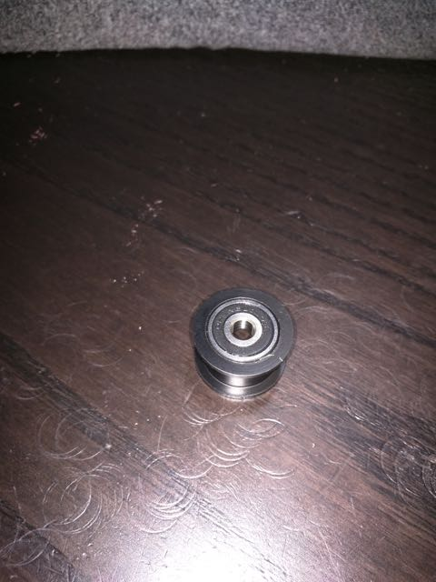
      
 108. Remove the M5x10mm button head screws in the remaining 4 T-Slot nuts installed in the center support and slide the T-Slot nuts out of the way, 2 to each side of center.
 
      Example: 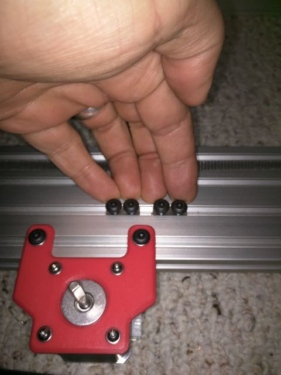
      
 109. Choose one side of the center support and split 2 of the 2 slot nuts and place the Z idler slide support in between them.
 
      Example: 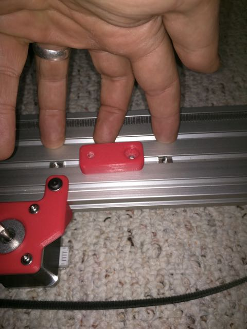
      
 110. Using a hex wrench, slide the t-slot nut closest to the recessed screw hole under the hole so that the threads align with the screw hole in the printed part.
 
 111. Insert 1 M5x10mm screw in this hole and tighten.
 
      Example: 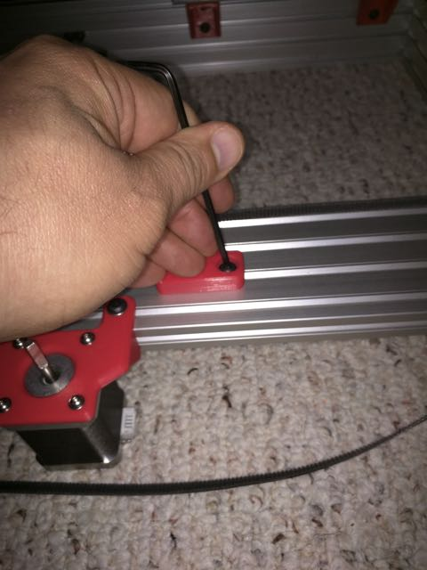
      
 112. Using a hex wrench, slide the other T-Slot nut under the other hole in the Z idler slide support.
 
      Example: 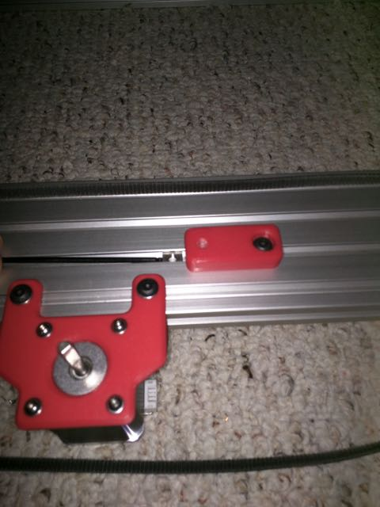
      
 113. Install 1 M5 standard washer on 1 M5x25mm socket cap screw.
 
      Example: 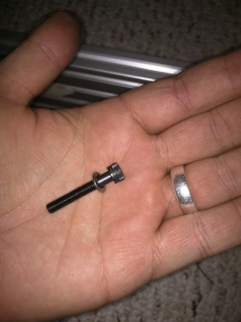
      
 114. Insert the screw through the center hole of the idler pulley.
 
      Example: 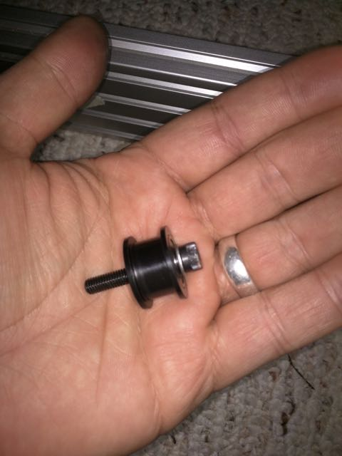
      
 115. Install 1 M5 standard washer on the screw, on top of the idler pulley.
 
      Example: 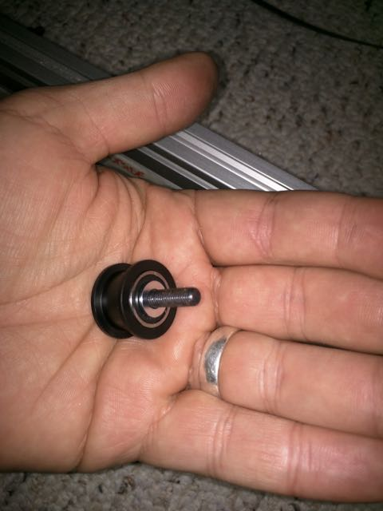
      
 116. Thread the assembly through the non-recessed screw hole of the Z idler slide support and snug.
 
      Example: 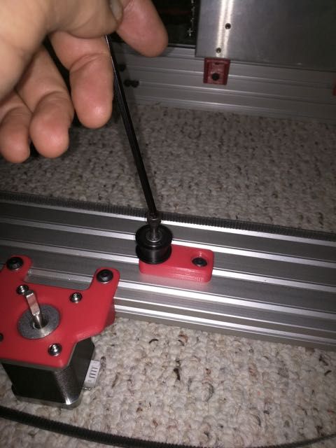
      
 117. The idler pulley should be able to spin freely.
 
      Example: 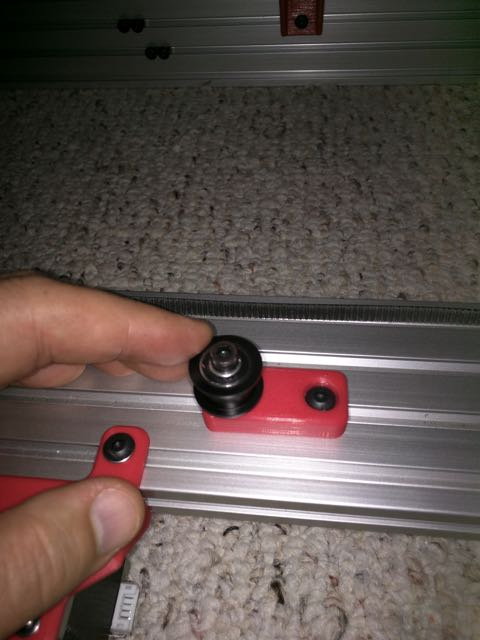
      
 118. Repeat steps 109 - 117 for the other side of the center support.
 
      Example: 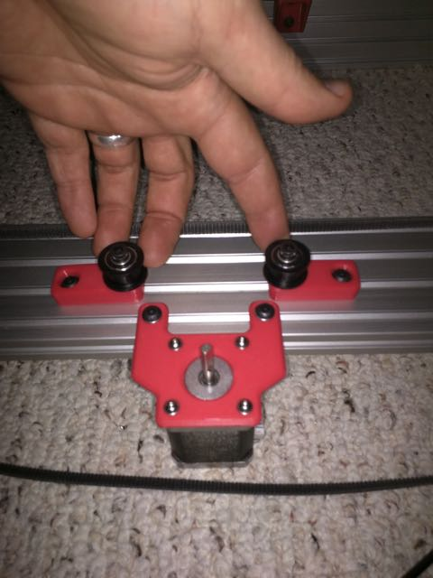
      
 119. Install the 20 tooth GT2 pulley on the center motor shaft but do not tighten yet.
 
 120. Feed the flat side of the belt around the idler pulley as pictured.  Then wrap the tooth side around the GT2 pulley on the motor. Finally feed the flat side around the other idler pulley.  You will likely need to loosen the Z idler slide support to make this work but be sure to find the ideal tension and tighten them down again.
 
      Example: 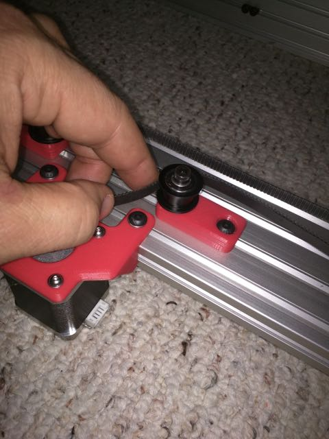
               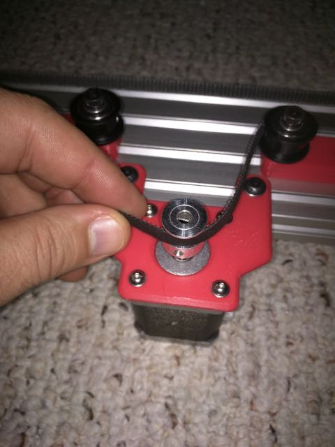
               
               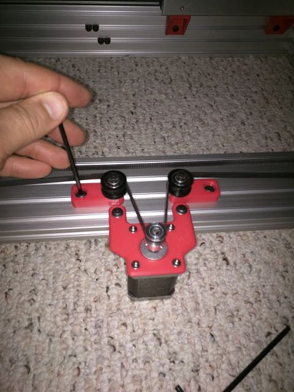
               
 121. Work the belt back and forth to help work the GT2 pulley onto the shaft of the stepper motor at the ideal height and then secure the GT2 pulley using it's set screws.
 
      Example: 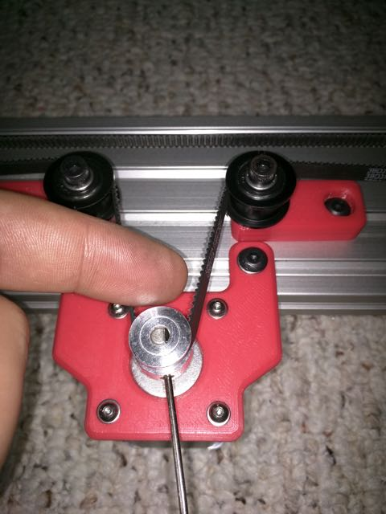
 
 122. Ensure the belt is flat against the pulley and not catching on the edges as this can damage the belt.
 
 123. Install the solid state relay on the bottom rear inside extrusion using 2 of the T-Slot nuts you inserted previously.  Use 2 M5x12mm socket cap screws to secure this in place.  Depending on your SSR you may need to tap the holes to allow the M5 screws to feed through.
 
      Example: 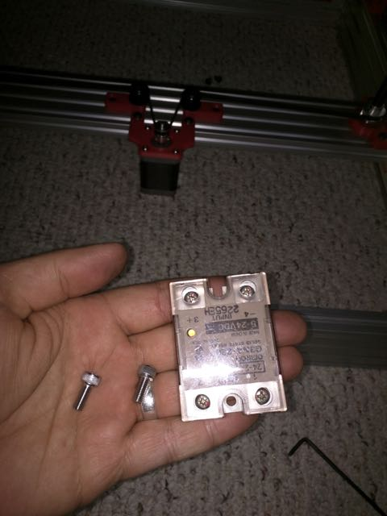
               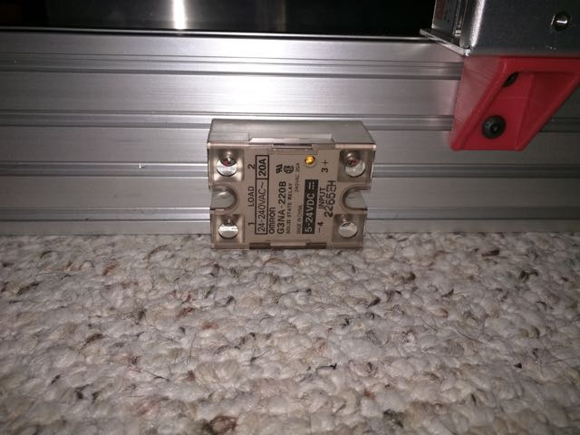
      
      * When you install the top side extrusions take care to align the 4 T-Slot nuts that are threaded on the M5x8mm button head screws with the 4 holes drilled in each extrusion and the slots in the V-slot verticals.  
      * Before tightening these screws make sure you measure 215mm from the front facing end of the extrusion to the edge of the V-Slot verticals to ensure proper alignment of the Z axis.
 
 124. Using the extrusion slot cover material, a sharp knife and a measuring instrument line all the slot channels that will be holding your plexiglass/acrylic covers if you are using them here.  Install the top extrusions into their respective sides to hole the plexiglass in.  If not using covers still install the top extrusions.
 
      Example: 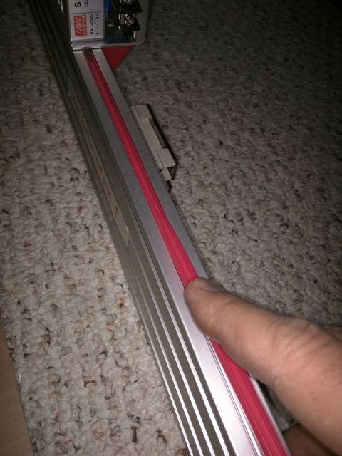
               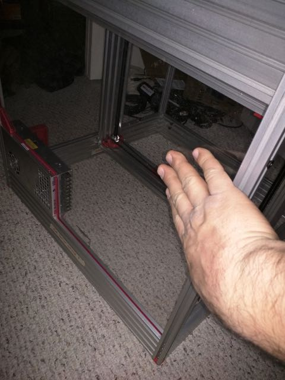
            
 125. Thats it for the Z axis and bottom chassis!

## X/Y Axis

 1. Locate 2 Corner Bearing Bracket A and 2 Corner Bearing bracket B printed parts.
 
    Example: 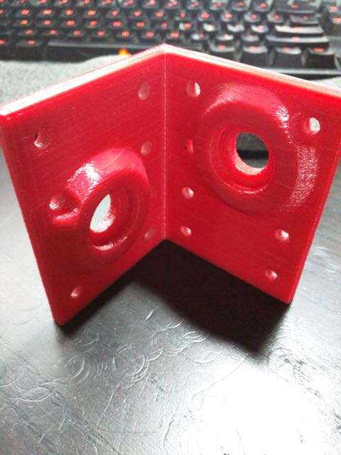
             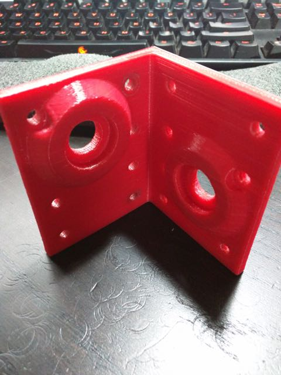
             
 2. Press fit 1 10mm (ID) x 22mm (OD) bearing into each of the bearing holes of the 4 printed corner bearing brackets.
    
    Example: 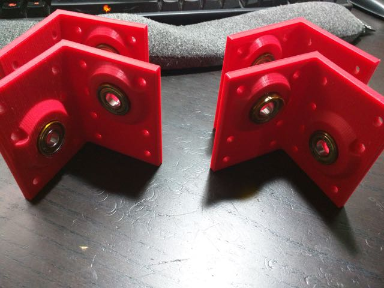
    
    * If the bearing holes are too tight, use acetone and a q-tip to wet the bearing hole walls until the abs is soft. Then press fit the bearing in.
    * If the bearing holes are too loose, wrap the outside wall of the bearing with a thin layer of kapton tape to shim the bearing.
    
 3. Starting with the front left top corner of the inside of the chassis place the corner bearing bracket that matches up with the holes drilled through the top extrusions.  This should be corner bearing bracket B.
    
    Example: 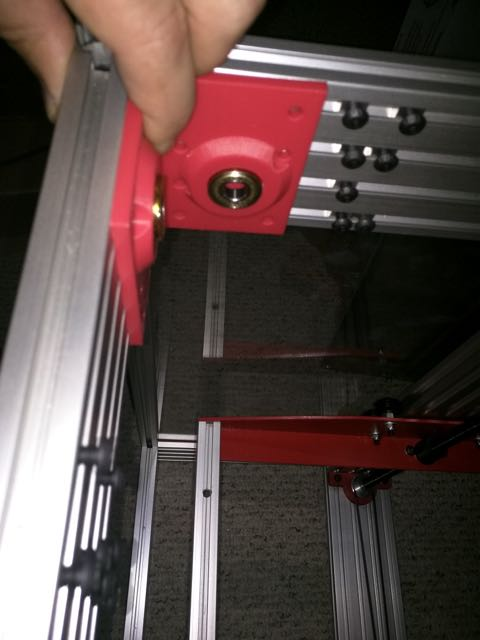
    
 4. On each side of the bracket you should remove enough of the prepopulated M5x10mm button head screws from the t-slot nuts that were installed earlier to be able to secure each of the screw holes of the corner bearing bracket plate.
 
 5. Using a hex wrench slide 1 t-slot nut behind one of the inner most screw holes of the corner bearing bracket and secure it with 1 M5x10mm screw.  Make sure that the corner bearing bracket is flush with the corner of the extrusions.  This is necessary for proper X/Y alignment.
    
    Example: 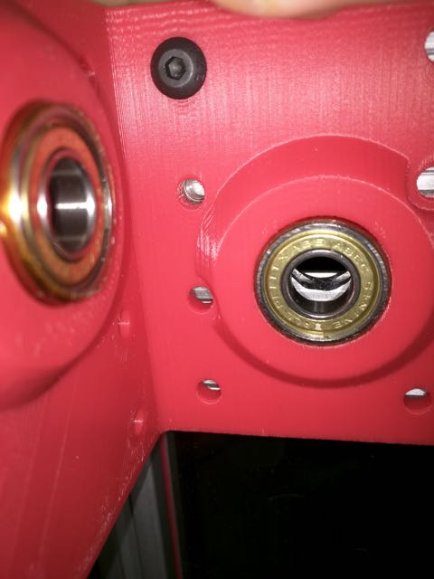
    
 6. Repeat this process for all of the holes of the corner bearing bracket.
 
    Example: 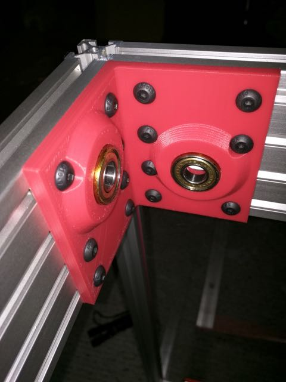
 
 7. Moving counter clockwise, repeat this process for the remaining 3 corners, take care to alternate corner bearing bracket versions each time.  e.g. Front right corner uses corner bearing bracket A.  Make sure the drilled holes in the extrusions line up with the corner bearing bracket's bearing holes.
 
    Example: 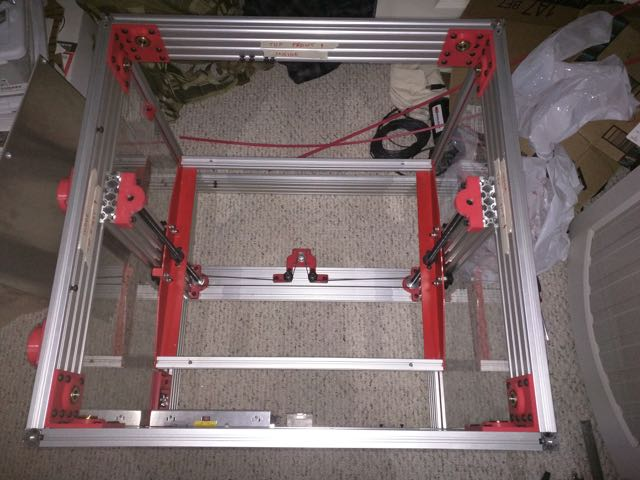
 
 8. Locate 2 610mm x 10mm hardened precsion rods, 2 printed rod end knobs, 2 M3 standard nuts and 2 M3x8mm button head screws.
 
 9. Carefully insert 1 M3 nut into the hexagonal shaped recess on the inside of 1 printed rod end knob.
 
    Example: 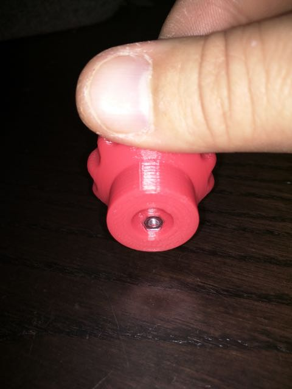
 
 10. Slide the rod end knob onto one end of 1 610mm precision rod.
 
     Example: 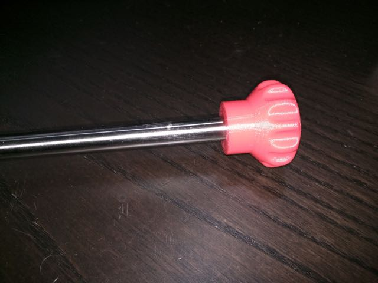
 
 11. Thread 1 M3x8mm button head screw through the screw hole of the rod end knob and tighten down enough to securely hold the rod end knob on the precision rod.
    
     Example: 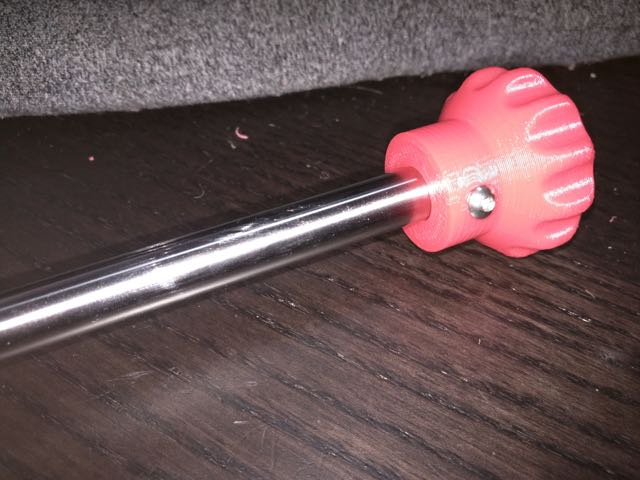
    
 12. Repeat steps 9 - 11 for the other precision rod.
 
 13. Locate 1 XY Axis Belt Tensioner A, 1 XY Axis Belt Tensioner Block A, 2 M3x50mm socket head screw, 4 M3 nylon lock nuts, 1 M5 standard hex nut, 1 M5x16mm button head screw, 2 sintered bronze bushings and 2 M3x25mm socket cap screws.
 
 14. Press fit the bronze bushings into the large holes of the XY Axis Belt Tensioner printed part.
 
      * If the fit is too tight, use acetone and a q-tip to soften the inner wall of the printed part's bushing hole and then press the bushing in.
      * If the fit is too loose, use kapton tape to shim the bushing and then press the bushing in.
      
      Example: 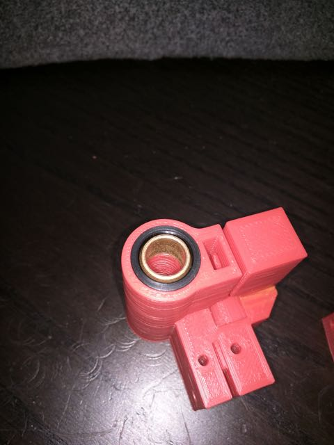
      
 15. Thread 1 M3x50mm socket cap screw through one of the 3mm holes in the bottom of the XY Axis Belt Tensioner.
     
     Example: 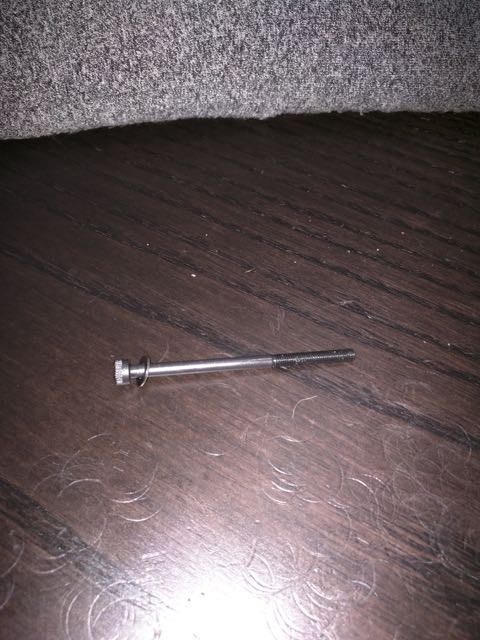
              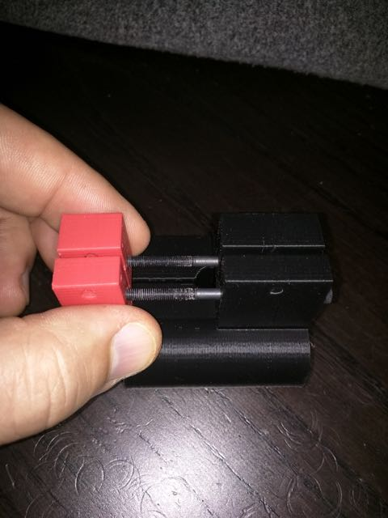
              
 16. Repeat the process for the other hole.
  
 17. Fit the XY Belt Tensioner Block's 2 holes on the end of the 2 M3x50mm screws taking care to align the slot for the GT2 belt.
     
     Example: 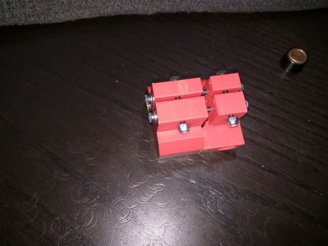
              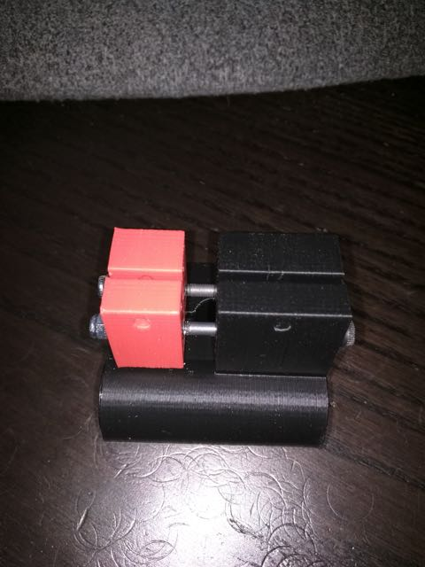
     
 18. Screw the screws through the tensioner block but not all the way.
  
 19. Screw on 1 nylon locknut on the end of each of the M3x50mm screws.
  
 20. Thread 1 M3x25mm through one of the belt slots.
  
 21. Screw on one nylon lock nut on the end of the screw but do not tighten.
  
 22. Repeat steps 10 - 11 for the other belt retension screw hole.
  
 23. Insert the M5 standard hex nut into the slot on top of the XY Axis Belt Tensioner.
     
     Example: 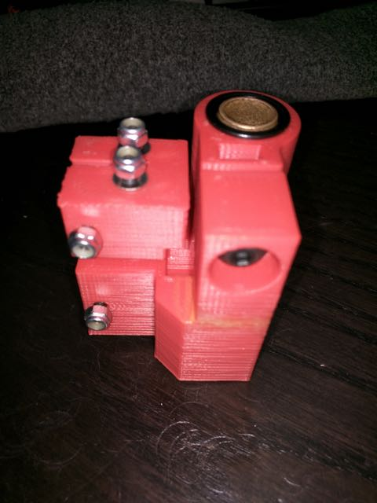
     
 24. Thread 1 M5x16mm button head screw through the recessed screw hole and thread the screw into the nut in the opposing side of the tensioner. DO NOT TIGHTEN! You will crack the part!!!  Just let the threads grab.
  
 25. The finished assembly will look like this:
 
     Example: 
  
 26. Repeat these steps for the other XY Axis Belt Tensioner A piece as well as the other 2 XY Axis belt tensioner pieces.  
  
 27. Set them aside for now.
  
 28. Locate the dual hotend carriage printed part.
 
     Example: 
  
 29. Insert M3 standard nuts into each of the slots of the carriage making sure to press them in until they are fully seated.
  
 30. Using the q-tip or kapton tape method described in step 14 press fit 1 10mm sintered bronze bushing into each busching hole of the carriage taking care to ensure that they're fully seated level or you will have binding issues.  Test the alignment by inserting a 512mm precision hardened rod into one of the axis and move the carriage up and down the shaft.  It should move as if there were a cushion of air between the bushing and the rod.
  
     * If you have minor binding you can insert one of the 512mm hardened precision rods into an electric drill and insert the precision rod into one of the carriage axis.  Then start spinning the rod slowly with the drill while moving the carriage up and down the shaft to force the self aligning bushings into alignment.
     * If you have major binding you can set the rod end on a hard surface and gently knock the bushing in by knocking the carriage into the hard surface.  Take care not to knock too hard or you could crack the carriage.
  
 31. Insert 1 512mm precision hardened rod through each axis of the carriage and set on a flat surface with the flat side of the carriage facing up and the end of the carriage that will house the hotends facing you.  This is the orientation of the carriage in the chassis when you are looking at the front.
     
     Example: 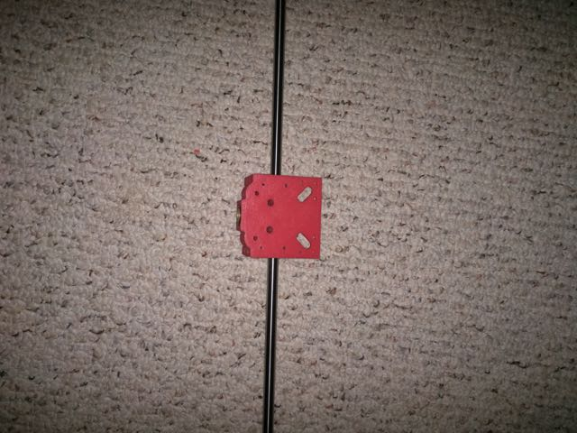
              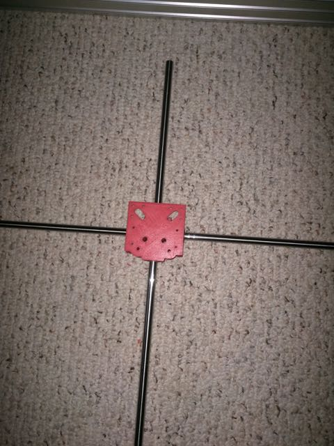
 
 32. Slide the large precsion rod hole of 1 XY belt tensioner A onto the right end of the rod assembly with the bushings on the top side of the tensioner.
    
     Example: 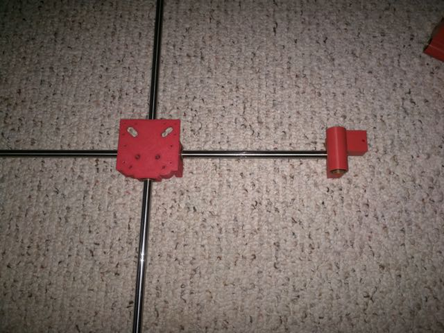
              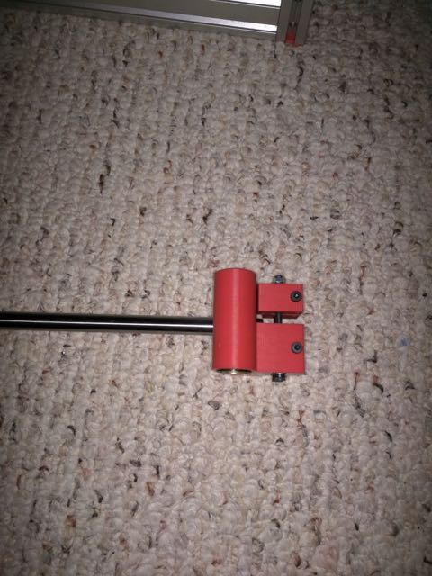
    
 33. Slide the large precision rod hole of 1 XY belt tensioner B onto the left end of the rod assembly with the bushings on the top side of the tensioner.
     
     Example: 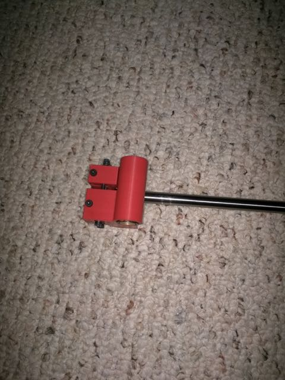
     
 34. Slide the large precision rod hole of 1 XY belt tensioner A onto the front end of the rod assembly with the bushings on the bottom side of the tensioner.
    
     Example: 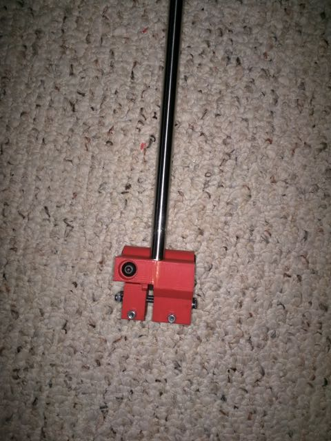
    
 34. Slide the large precision rod hole of 1 XY belt tensioner B onto the back end of the rod assembly with the bushings on the bottom side of the tensioner.
  
     Example: 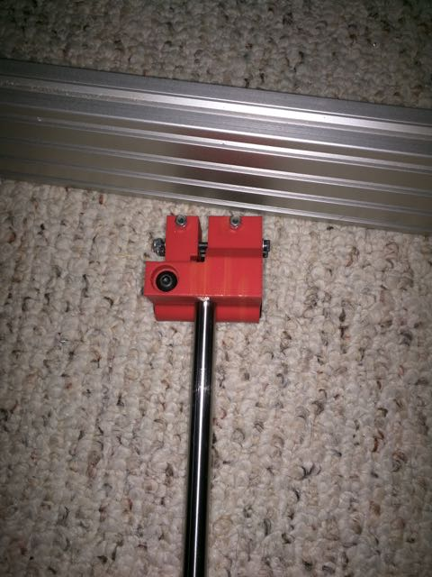
  
 35. Gently tighten the M5x16mm screw.  Take care not to over tighten because you will crack the part.  It only needs to be snug.
  
     * If you over tighten any of the screws and the part cracks you can remove the part and slightly bend it to expose the crack and then apply a small drop of acetone into the crack then use a clamp to hold the piece together until the acetone sets and the acetone glue is hardened.
      
 36. This will be the orientation you will install the XY axis in the chassis.
  
     Example: 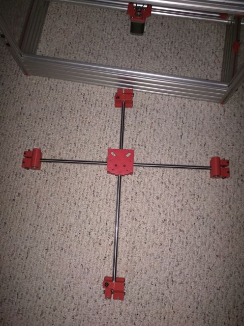
  
 37. Locate 2 10mm shim washers, 1 610mm precision hardened rod and 2 32 tooth GT2 pulleys
  
 38. Starting with the front left rod, using the precision hardened rod you installed a rod end knob on, slide the rod into the hole drilled through the front extrusion.
     
     Example: 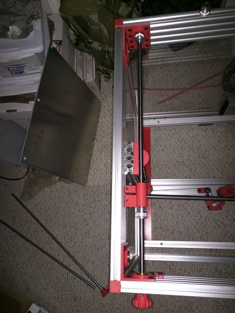
     
 39. As the rod enters the inside of the chassis install 1 10mm shim washer and then 1 32 tooth pulley with the teeth closest to the inside face of the extrusion.
     
     Example: 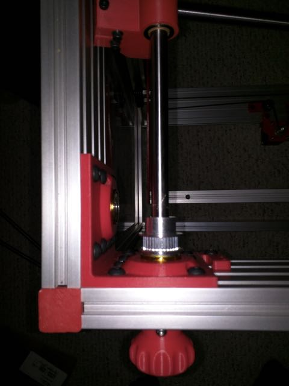
     
 40. Keeping the orientation that was previously established for the carriage feed the rod through the sintered bronze bushings of the XY tensioner B taking care to ensure that the bushings are on the top side of the tensioner.
     
     Example: 
     
 41. Before feeding the other end of the rod into the bearing in the opposite side corner bearing bracket insert a 32 tooth pulley with the tooth side facing the corner bearing bracket.
  
     Example: 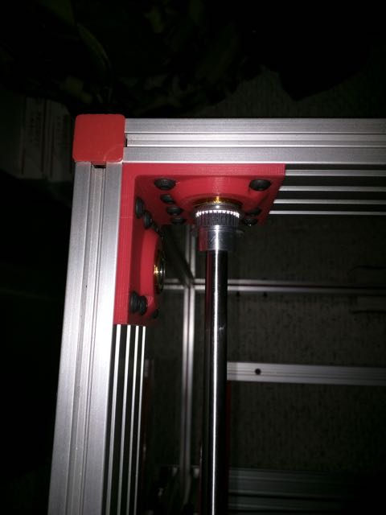
  
 42. Install a 10mm shim washer, then slide the end of the rod into the bearing.
  
 43. Repeat steps 27 - 32 for all 4 rods making sure to keep things as aligned as possible.  The rods with the rod end knobs should be used for the 2 rods that go on the front left side and the left front side extrusions.
  
 44. Locate one 1 meter section of GT2 belt.
  
 45. Choose one side of the chassis and slide the end of the belt into the slot of the XY belt tensioner block taking care to slide the belt into the block until it is fully seated and the teeth of the belt have engaged in the block's teeth thus keeping the belt locked in place.
  
 46. Locate 1 M3x25mm socket cap screw and 1 nylon lock nut.
  
 47. Thread the screw through the screw hole in the tensioner block and install the nylon lock nut on the screw end.
  
 48. Tighten the lock nut until the screw is snug, do not over tighten or you will crack the printed part.
  
 49. Pass the GT2 belt around the 32 tooth pulley on the side of the block that you installed the belt end into.
  
 50. Stretch the belt over the opposing 32 tooth pulley and back around to the XY belt tensioner.
  
 51. Cut the belt to length leaving enough belt to fit through the belt slot of the tensioner to help with seating the belt.
  
 52. Slide the belt end into the belt tensioner slot and seat the belt completely making sure that the teeth of the belt seat inside of the belt tensioner.
  
 53. Locate 1 M3x25mm socket cap screw and 1 nylon lock nut.
  
 54. Thread the screw through the screw hole in the tensioner and install the nylon lock nut ont he screw end.
  
 55. Tighten the lock nut until the screw is snug.  Do not over tighten or you will crack the printed part.
  
 56. Now using a hex wrench and 5.5mm socket wrench adjust each of the 50mm socket cap screws that run through the tensioner and tensioner block until the belt is tight but not guitar string tight.
     
     Example: 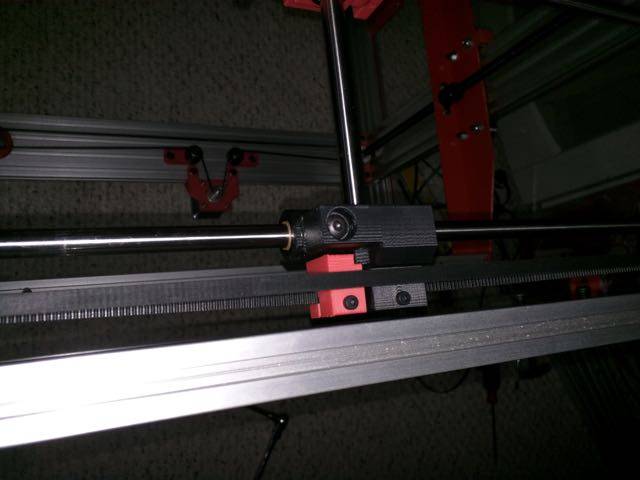
     
 57. Repeat steps 35 through 46 for the remaining 3 sides.
  
 58. You should now be able to use the 2 rod end knobs on the front and left side to move the XY carriage, like an Etch-a-sketch.

## Front door assembly

 1. Locate 2 407.5mm 20x20mm extrusions
 
 2. Carefully tap each end of the extrusions
    
    Example: 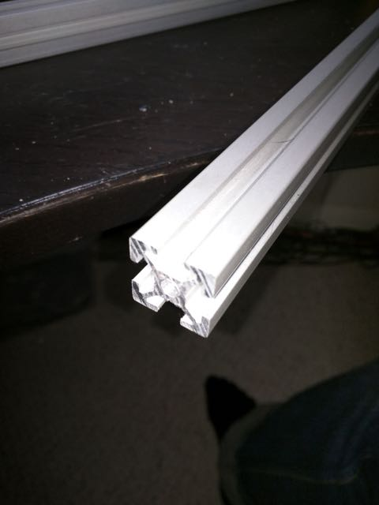
    
 3. Thread 1 M5x10mm button head screw into each end of each of the extrusions leaving approximately 3mm of thread showing.
 
 4. Locate the 20x20mm drill guide.
 
 5. Locate 2 567.5mm 20x20mm extrusions.
 
 6. Carefully tap each end of the extrusions.
 
 7. Using 3 M5x8mm button head screws and 2 T-Slot nuts install the drill guide on one of the 567.5mm extrusions.
    
    Example: 
             
    
 8. Drill the first hole on one side of the extrusion drill guide through the extrusion.
    
    Example: 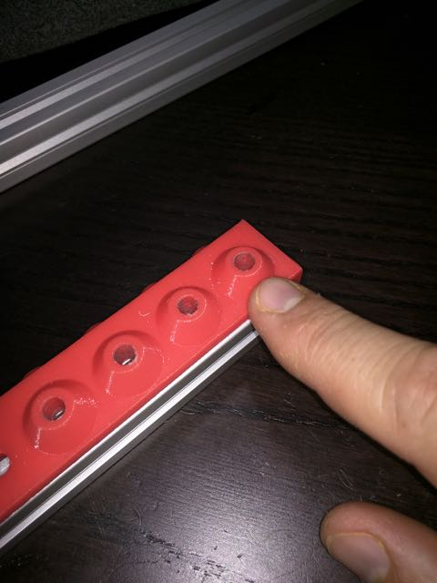
             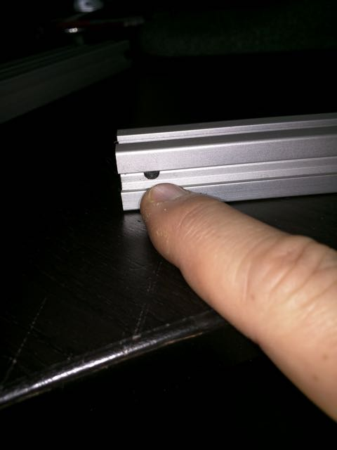
    
 9. Repeat steps 7 - 8 for each end of the 2 567.5mm 20x20mm extrusions.
 
 10. On a flat surface place one 567.5mm 20x20mm extrusion laying horizontal with the holes that were drilled facing toward you and away from you.
 
 11. Locate the 2 407.5mm 20x20mm extrusions that were previously tapped.
 
 12. on each end of the 567.5mm extrusion insert the head of the socket cap screw of each of the 407.5mm extrusions making a "U" shape.
 
     Example: 
 
 13. Keeping the extrusions flush on the edge pass a hex wrench through the drilled holes and tighten the button head screws.
     
     Example: 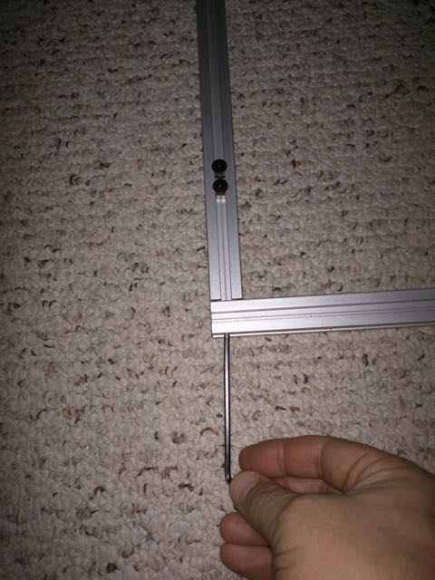
     
 14. Lay the tightened door assembly down on a flat surface with the opening of the "U" facing away from you.
    
     Example: 
    
 15. On the top side of the left 407.5mm extrusion insert 4 T-Slot nuts and hand tighten 1 M5x8mm flat head hex screw into each one to keep them from sliding.
 
     Example: 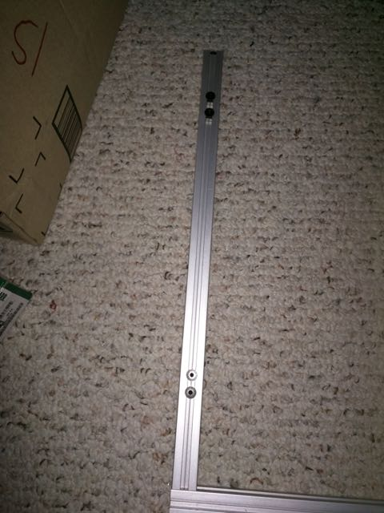
 
 16. On the top side of the right 407.5mm extrusion insert 2 T-Slot nuts and hand tighten 1 M5x16mm button head screw into each one to keep them from sliding.
 
     Example: 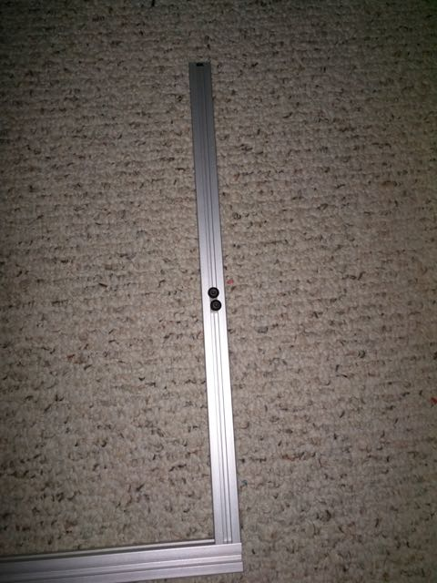
 
 17. Locate a section of T-Slot cover, a sharp knife and a measuring instrument.
 
 18. Measure and install the T-Slot cover upside down in each of the inner channels to hold the clear plexiglass cover.
 
     Example: 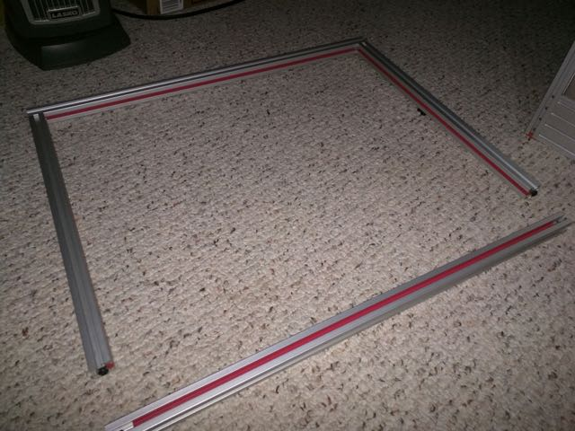
 
 19. Install the plexiglass cover in the channels of the U.
 
 20. Slide the remaining 567.5mm 20x20mm extrusion onto the ends of the button head screws of the open side of the U shape and keep the edges flush while tightening down the assembly.
     
     Example: 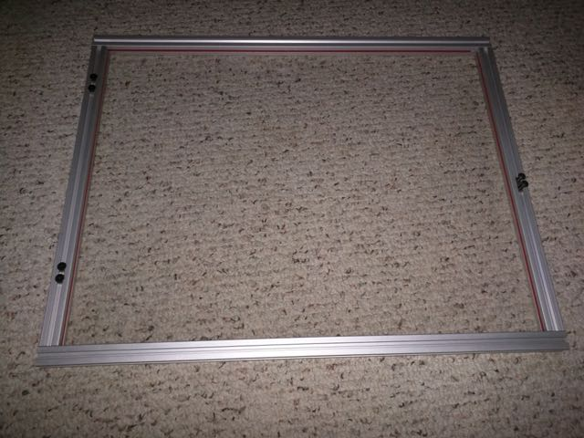
     
 21. Locate 2 extrusion hinges.
 
 22. Face the main chassis assembly, looking at the front side.
 
 23. On the left front corner 20x20mm vertical extrusion on the main chassis install 4 T-Slot nuts and hand tighten 1 M5x8mm flat head screw into each to keep them from sliding.
     
     Example: 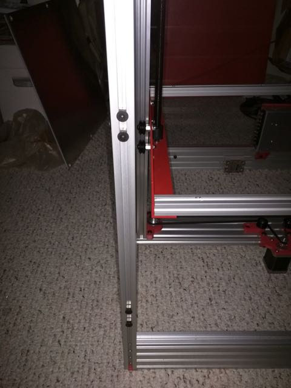
     
 24. Install the 2 extrusion hinges on the main chassis using the 4 T-Slot nuts and 4 5x8mm flat head screws installed in the previous step.
 
     Example: 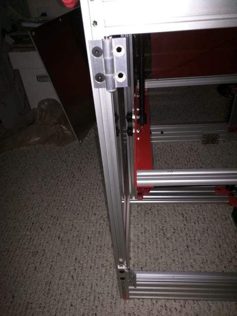
 
 25. Using the 4 T-Slot nuts and 4 M5x8mm flat top screws previously installed on the front door, install the door on the main chassis.
     
     Example: 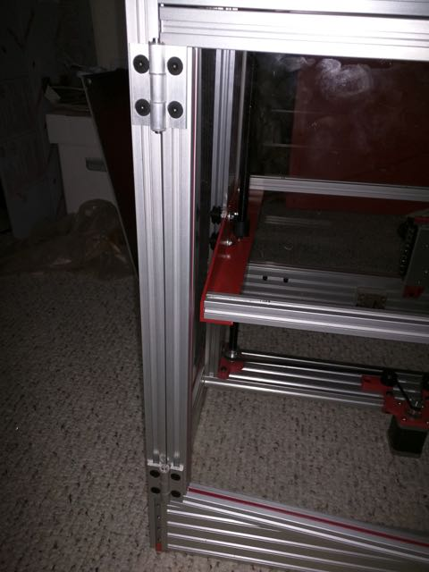
              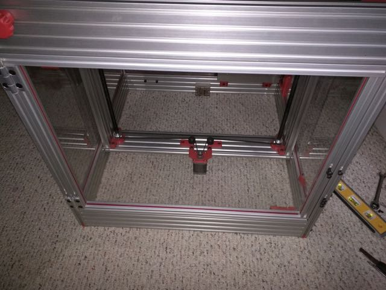
     
 26. Locate the plastic door handle or a printed handle.
 
 27. Using the 2 T-Slot nuts and 2 M5x16mm button head screws installed previously in the right side of the front door, install the handle.
 
     Example: 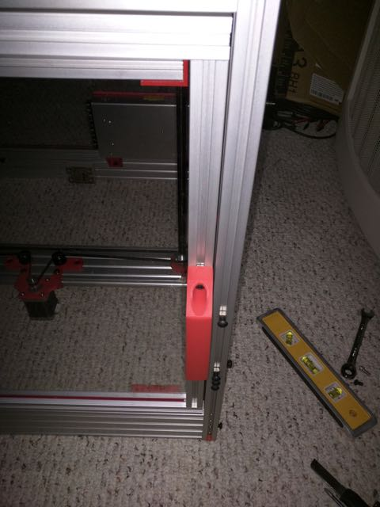

## Top cover assembly

 1. Locate 4 330mm 20x20mm extrusions, 7 569.5mm 20x20mm extrusions, 1 100mm 20x20mm extrusion, 1 55mm 20x20mm extrusion and 1 515mm 20x20mm extrusion.
 
 2. Carefully tap each end of all of the extrusions with an M5 x .8mm tap.
 
 3. Thread an M5x10mm button head screw into the end of each of the 7 569.5mm 20x20mm extrusions and 1 515mm 20x20mm extrusion leaving only 2mm of thread showing.
 
 4. Thread an M5x10mm button head screw into one end of the 100mm 20x20mm extrusion and 55mm 20x20mm extrusion leaving only 2mm of thread showing.
 
 5. Locate the 20x20mm extrusion drill guide.
 
 6. Using 3 M5x8mm button head screws and 2 T-slot nuts install the drill guide on the end of 1 330mm 20x20mm extrusion.
 
 7. Carefully drill the first hole near the end of the extrusion on both sides of the extrusion using a 5mm drill bit.
 
 8. Repeat this process for each end of the 4 330mm 20x20mm extrusions.
 
 9. Install the drill guide on the end of the 100mm 20x20mm extrusion that doesn't have the M5x10mm screw threaded into it.
 
 10. Carefully drill the first hole near the end of the extrusion on only one side.
 
 11. Repeat steps 9 - 10 for the end of the 55mm 20x20mm extrusion.
 
 12. Locate 1 330mm 20x20mm extrusion and measure 110mm from one end, on once side, and mark with a center punch or other device to leave a clear mark that will help with drilling.
 
 13. Carefully drill straight through the extrusion. This is only done on one extrusion and makes this extrusion the front right corner of the lid.
 
 14. Locate 1 515mm 20x20mm extrusion, 1 100mm extrusion and 1 55mm extrusion.
 
 15. Place the 515mm 20x20mm extrusion on a flat surface.
 
 16. Slide the button head screw on the left side of the 515mm extrusion into the slot of the 100mm extrusion with the hole drilled through until the extrusions are flush.
 
 17. Pass a hex wrench through the hole of the 100mm extrusion and tighten the M5x10mm screw down making sure to keep things flush and flat.
 
 18. Locate the 55mm extrusion.
 
 19. Slide the end of the 55mm extrusion with the hole drilled through it over the M5x10mm button head screw at the end of the 100mm extrusion lining up the hole in the 55mm extrusion with the button head screw.
 
 20. Pass a hex wrench through the hole of the 55mm extrusion and tighten the button head screw down while keeping things flush and flat.
 
 21. Locate the 330mm extrusion that was drilled not only near the ends but also drilled 110mm from one end through the slot.
 
 22. Slide the 330mm extrusion over the M5x10mm button head screw util the end of the extrusion is lined up with the bottom of the 515mm extrusion and the hole drilled through the 330mm extrusion is lined up with the button head screw of the 55mm extrusion.
 
 23. Pass a hex wrench through the middle hole and tighten the M5 screw keeping things flush and flat.
 
 24. Locate 3 569.5mm extrusions and place them in the shape of a U with the opening of the U facing the right.
 
 25. If you want to install a lift handle on the front face of the lid, on the front face of the 20x20mm extrusion insert 2 T-Slot nuts and tighten 1 M5x16mm button head screw into each to keep them from sliding.
 
 26. If you are installing the sliding hinge on the lid, on the front face of the 20x20mm extrusion insert 1 T-Slot nut and thread 1 M5x16mm button head screw into it and tighten enough to keep things from sliding.
 
 27. Insert 2 T-Slot nuts and hand tighten 1 M8x8mm flat top screw in the left facing slot of the left extrusion.  This is for the hinges.
 
 27. Place the assembly with the 55, 100 and 515mm extrusions tightend to it on the opening of the U and slide the button head screw of the front right end through the 330mm extrusion.
 
 28. Pass a hex wrench through the bottom hole of the 330mm extrusion and tighten, take care to make sure things are flush and flat.
 
 29. Locate 3 330mm 20x20mm extrusions.
 
 30. Slide one end of a 330mm extrusion over the button head screws at each of the 3 other corners of the lid assembly.
 
 31. Using a hex wrench passed through the holes drilled through these extrusions tighten all of the screws down keeping things flush and flat.
 
 32. Locate some T-Slot covers, a sharp knife and measuring device.
 
 33. Carefully measure and insert the T-Slot covers into the inner channels of the whole assembly to pad the channels for housing the covers.
 
 34. Install the 4 clear side panels in the lid.
 
 35. Install T-Slot covers in the 4 remaining 569.5mm extrusions on 2 of the faces next to each other.
 
 36. Install 3 of the 569.5mm extrusions on the lid top on the rear, left and right sides.
 
 37. Passing a hex wrench through the drilled holes in the vertcial 330mm extrusions tighten the 3 installed extrusions.
 
 38. Loosen the bottom front screws to allow the front two verticals to move outward.  This is just to install the top clear panel.
 
 39. Slide the top clear panel and ensure it is fully seated in the rear, left and right channels.
 
 40. Install the remaining 569.5mm extrusion on the top front of the cover and tighten all M5 screws in all of the top and bottom corners.
 
 41. Locate 2 aluminum extrusion hinges.
 
 42. Using the preinstalled T-Slot Nuts and M5x8mm flat top screws install the hinges in the front and rear corners of the left side of the lid and chassis.
 
 43. Locate a plastic handle or a printed handle.
 
 44. Using the preinstalled T-Slot nuts and M5x16mm button head screws install the handle on the lid.
 
 45. Locate the printed sliding hinge.
 
 46. Using the preinstalled T-Slot nuts and M5x16mm buttn head screws install the hinge but before tightening down the sliding piece of the hinge open the lid until it is opened to the point that you like, then tighten down the last screw.
 
 Thats it! the Mechanincal 
 
 